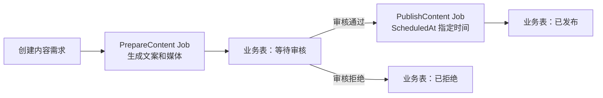
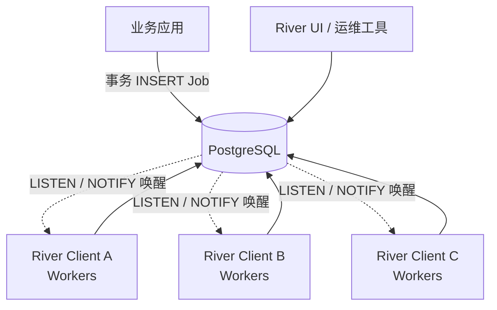

# River 基础与架构：从事务入队到三节点 Worker 集群

River 内容分成四篇：

1. **本文**；

2. [第 2 篇](./052_river_job_assignment.md)；

3. [第 3 篇](./053_river_execution_recovery.md)；

4. [第 4 篇](./054_river_task_delivery_data_model.md)。

## 1. 结论先行

River 是一个**嵌入 Go 应用、以数据库作为持久化队列的后台任务库**。它最突出的设计是：业务数据和 Job 可以在同一个数据库事务里提交，减少“业务已成功，但异步任务没有发出去”的双写问题。

它适合邮件、Webhook、报表、媒体处理、索引更新、批量导入，以及由 Go 服务驱动的 AI API 调用。当前开源版还支持 Resumable Jobs：把一个 Worker 划分为命名步骤，通过持久化进度跳过已完成步骤。但跨多个 Job 的原生依赖图、工作流 Signal/Timer 等属于 River Pro，应与开源版区分。[包文档](https://github.com/riverqueue/river/blob/a4cf56f7233ce1a84a4dc188d91bd09399522763/doc.go)、[Pro 能力说明](https://riverqueue.com/pro)。

| 维度 | 结论 |
|---|---|
| 项目类型 | 数据库支持的后台任务队列，Go 应用内集成 |
| 开源协议 | 仓库 LICENSE 标注 MPL-2.0 |
| 项目热度 | 调研时 GitHub API 返回约 5.7k Star，2026-09-10 仍有推送 |
| 核心执行单元 | 一条 Job 记录，以及按 kind 注册的 Go Worker |
| 原生存储驱动 | PostgreSQL、SQLite；本文多节点实例采用 PostgreSQL |
| 开源版恢复方式 | Job 重试、stuck job 回收、命名步骤和游标检查点 |
| 工作流产品边界 | 开源版提供任务和步骤；Pro 提供跨 Job 的 Workflow DAG 等能力 |
| 主要取舍 | 集成成本低、事务边界清晰；复杂流程的平台能力需应用补齐或采用 Pro |

项目与维护信息来自 [GitHub 仓库](https://github.com/riverqueue/river)；版本依据见固定提交的 [CHANGELOG](https://github.com/riverqueue/river/blob/a4cf56f7233ce1a84a4dc188d91bd09399522763/CHANGELOG.md)。驱动范围见 [官方驱动说明](https://riverqueue.com/docs/database-drivers)。

## 2. 贯穿实例：生成内容、人工审核与定时发布

以一个 Go 驱动的自媒体后台为例：用户创建内容需求，后台生成文案和媒体文件，审核通过后在指定时间发布。以下是**基于 River OSS 设计的应用流程**，不是声称开源版内置了这张 Workflow 图。



### 2.1 一次执行的完整路径

1. API 在同一 PostgreSQL 事务中创建 `content_request`，并 `InsertTx` 插入 `PrepareContentArgs{RequestID: 42}`。
2. 事务提交后，某个 Client 领取 Job，按 `kind` 找到 `PrepareContentWorker`。
3. Worker 调用模型或 Python 服务，产物存到对象存储，业务表记录 URI 和处理进度。
4. 准备完成后，在同一事务中更新业务状态为 `waiting_review`，创建审批记录，并用 `JobCompleteTx` 完成当前 Job。
5. 等待审核期间没有正在执行的 Worker；等待状态在业务表中。
6. 审核 API 校验权限和当前版本，在同一事务中记录批准结果，并插入带 `ScheduledAt` 的 `PublishContent` Job。
7. 到期后 Scheduler 使任务可以被领取。发布 Worker 调用外部平台，记录平台内容 ID 和最终业务状态。

这里两类状态分工明确：`river_job.state` 描述某个后台任务的生命周期；`content_request.status` 描述用户关心的完整业务进度。`PrepareContent` 已完成而业务仍在等待审核，是正常状态。

### 2.2 事务入队的 Go 示例

以下为集成片段，假定业务表、`dbPool`、`riverClient` 和 Worker 注册已经准备好：

```go
type PrepareContentArgs struct {
    RequestID int64 `json:"request_id"`
}

func (PrepareContentArgs) Kind() string { return "prepare_content" }

func CreateRequest(
    ctx context.Context,
    dbPool *pgxpool.Pool,
    riverClient *river.Client[pgx.Tx],
    topic string,
) (int64, error) {
    tx, err := dbPool.Begin(ctx)
    if err != nil {
        return 0, err
    }
    defer tx.Rollback(ctx)

    var id int64
    err = tx.QueryRow(ctx,
        `INSERT INTO content_request(topic, status)
         VALUES ($1, 'preparing') RETURNING id`, topic,
    ).Scan(&id)
    if err != nil {
        return 0, err
    }

    _, err = riverClient.InsertTx(ctx, tx,
        PrepareContentArgs{RequestID: id},
        &river.InsertOpts{Queue: "media"},
    )
    if err != nil {
        return 0, err
    }
    if err := tx.Commit(ctx); err != nil {
        return 0, err
    }
    return id, nil
}
```

事务回滚，两条记录一起撤销；事务提交，业务记录和 Job 一起可见。若在事务外另调 `Insert`，或者业务数据位于另一个独立数据库，就没有这个原子边界。API 自身的重复请求仍需业务幂等键处理。接口依据见 [InsertTx 所在的 client.go](https://github.com/riverqueue/river/blob/a4cf56f7233ce1a84a4dc188d91bd09399522763/client.go)。

## 3. 三节点架构：只看结论



三个 River Client 都连接同一个 PostgreSQL，并注册相同或不同 Kind 的 Go Worker。它没有独立 Broker、Matching 或中心 Scheduler：

- Job 的权威记录和队列都在 PostgreSQL；
- 多个 Client 通过数据库并发领取机制竞争可执行 Job；
- 某个 Client 获得本次执行权后，按 Kind 调用本进程注册的 Worker；
- 维护任务可由选出的 Leader 执行，但普通 Job 不需要先统一分配给固定节点；
- Client 崩溃后，其他 Client 根据数据库状态恢复任务。

具体锁、`SKIP LOCKED`、Queue 并发限制和 Leader 选举见 [052](./052_river_job_assignment.md)，逐次数据变化见 [054](./054_river_task_delivery_data_model.md)。

### 3.1 回到示例：内容生产 Job 怎样经过这张架构图

前面的 `PrepareContentJob` 会这样运行：

```text
1. 业务应用在同一个 PostgreSQL 事务中写入 article 和 river_job
2. 事务提交后，LISTEN/NOTIFY 唤醒 River Client；即使通知丢失，定期轮询也会发现 Job
3. Client A、B、C 同时查询 content Queue 中到期的 available Job
4. 数据库并发领取让其中一个 Client 把 Job 42 更新为 running，其他 Client 跳过它
5. 获得 Job 的 Client 按 Kind 找到本进程注册的 PrepareContentWorker
6. Worker 返回成功、错误或 Snooze，Client 把结果写回 river_job
7. 后续步骤由新的 Job、Resumable Job 或业务状态显式创建和推进
```

| 问题 | 结论 | 详细原理 |
|---|---|---|
| Job 状态和队列归谁 | PostgreSQL 中的 `river_job` 同时保存权威状态和可领取队列记录 | [053](./053_river_execution_recovery.md) |
| Job 归哪个 Client | 多个 Client 通过数据库锁和 `SKIP LOCKED` 类机制竞争；成功更新状态者取得本次执行权 | [052](./052_river_job_assignment.md) |
| Job 归哪个 Worker | Client 根据 Kind 调用本进程注册的 Go Worker；Worker 不是远程节点 | [054](./054_river_task_delivery_data_model.md) |
| 怎样并发 | 不同 Job 可由多个 Client 并发；Queue 的 MaxWorkers 主要限制单个 Client 的本地执行槽位 | [052](./052_river_job_assignment.md) |
| 谁推进 Workflow | River Client 只推进单个 Job 状态；跨 Job Workflow 需要业务代码、Resumable Jobs 或 River Pro 显式组织 | [053](./053_river_execution_recovery.md) |

River 没有独立 Scheduler 或 Matching。完整领取请求和 `river_job` 字段变化见 [054](./054_river_task_delivery_data_model.md)。

## 4. 从实例理解核心对象

| River 抽象 | 定义 | 内容处理实例 |
|---|---|---|
| JobArgs / Kind | JSON 可序列化参数与稳定类型名 | `PrepareContentArgs`、`prepare_content` |
| Worker | 实现 `Work(ctx, job)` 的 Go 类型 | 生成文案、调用渲染服务 |
| Workers registry | kind 到 Worker 实现的注册表 | 进程启动时注册所有相关类型 |
| Job / JobRow | 类型化参数与持久化任务记录 | Job 1001，对应内容需求 42 |
| Attempt | 同一 Job 的一次执行尝试 | 第一次模型调用失败，第二次重试 |
| Queue | 领取和本地并发配置的逻辑分组 | `media`、`publish` |
| InsertOpts | 入队时指定调度、队列、重试和唯一性等 | 发布时间、最大尝试次数 |
| ResumableStep / Cursor | 单个 Job 内的步骤与循环进度 | 已生成文案，接着生成媒体 |
| RecordOutput | 把 JSON 结果记到 Job metadata | 临时记录产物 URI 或外部资源 ID |
| PeriodicJob | 周期性创建新 Job 的定义 | 定期刷新平台统计 |

开源版的核心闭环是：**插入 Job → 数据库领取 → Worker 执行 → 更新同一 Job 的状态**。ResumableStep 只是这个闭环内的细粒度进度，不会自动把每个步骤变成可以交给其他机器独立执行的 Job。

## 5. 定时任务、人工等待与跨 Job 编排

### 5.1 Scheduled Job 与 Periodic Job 是两个层次

| 能力 | 保存什么 | 重启后的行为 |
|---|---|---|
| OSS Scheduled Job | 一条已入库 Job 的 `scheduled_at` 和状态 | 已提交任务仍在，服务恢复后可继续推进 |
| OSS Periodic/Cron Job | 周期定义及下一次运行计算主要在 Leader 内存 | 新 Leader 从当前时间重新计算，切换窗口可能漏一次触发 |
| Pro Durable Periodic Job | 持久化周期运行时间 | 提供持久周期调度能力，具体策略按采用版本配置 |

OSS 周期任务定义应在所有可能成为 Leader 的执行 Client 上保持一致。`RunOnStart` 配合 UniqueOpts 能缓解部分切换漏触发或重复入队问题，但不等于通用的历史补数机制。[官方周期任务说明](https://riverqueue.com/docs/periodic-jobs)。

### 5.2 人工审核怎样建模

在上述 OSS 方案里，审批等待存于业务表，审批 API 用事务插入后续任务。若需要 24 小时超时，可同时安排一个检查任务；它执行时用条件更新判断业务是否仍在等待。审批和超时竞争时，数据库状态转换决定胜者，重复或过期的任务应直接结束。

这种设计不需要长期占着 Worker，但审批候选人、权限、撤回、改派、审计和超时竞争均由业务应用负责。River UI 的取消、重试按钮也不能替代业务审批动作。

### 5.3 什么时候需要 River Pro Workflow

如果一个内容任务要并行生成多个尺寸的视频，等所有分支完成才进入审核，继续手写“子任务计数 + 汇合条件 + 失败传播”就会逐渐形成自己的编排引擎。

River Pro 的公开文档提供跨 Job 的 DAG、依赖和分支汇合、动态增加任务，以及持久 Signal、Timer 和等待条件。每个任务可独立重试；定义主要通过 Go builder 完成。本文只确认这些公开能力，未审阅私有实现。[Pro Workflow 文档](https://riverqueue.com/docs/pro/workflows)。

还要区分 OSS `InsertMany` 的批量入队与 Pro 的 Batching 功能：一次插入多条任务不意味着已经获得成组任务编排能力。同理，OSS `MaxWorkers` 与 Pro 的全局并发限制不是同一个配置层级。[Pro 能力矩阵](https://riverqueue.com/pro)。

## 6. Queue 容量、执行类型与 Go/Python 协作

### 6.1 MaxWorkers 是本地并发数

假设 A、B、C 都设置 `media.MaxWorkers = 10`，正常情况下合计最多有约 30 个该队列的执行槽位，而不是全局 10 个。producer 按 `MaxWorkers - 当前活跃任务数` 决定领取容量。

将 `media` 和 `publish` 配成不同队列，可以分别控制耗时任务和发布请求的本地并发。对于“某个模型 API 在全系统最多并发 5 次”之类约束，需要共享限流机制或评估 Pro 全局并发能力，不能靠每台机器各设 5 来实现。[producer 容量计算](https://github.com/riverqueue/river/blob/a4cf56f7233ce1a84a4dc188d91bd09399522763/producer.go)。

还有一个部署细节：领取按 Queue 筛选，并不按“本进程碰巧注册了哪些 kind”自动过滤。消费同一队列的进程必须能够处理其中的任务类型。当前 Rescuer 对无法识别的 kind 也有丢弃分支，因此可能担任维护 Leader 的 Client 应保持完整、兼容的 Worker 注册与相关配置；不能只改变副本数而忽略注册表。[JobGetAvailable](https://github.com/riverqueue/river/blob/a4cf56f7233ce1a84a4dc188d91bd09399522763/riverdriver/riverpgxv5/internal/dbsqlc/river_job.sql)、[Rescuer 类型查找](https://github.com/riverqueue/river/blob/a4cf56f7233ce1a84a4dc188d91bd09399522763/internal/maintenance/job_rescuer.go)。

### 6.2 支持哪些工作节点

River 的任务类型由 Go Worker 代码定义，没有内置一套 HTTP、SQL、Bash、人工审批的可视化节点目录。

| 工作 | 典型实现 |
|---|---|
| HTTP、Webhook、模型调用 | Go Worker 调用 API，并设置超时和幂等键 |
| SQL、批量数据处理 | Worker 执行数据库操作，必要时事务完成或记录游标 |
| 媒体处理 | Worker 调用 FFmpeg、容器服务或远程渲染 API |
| Python 模型与 Agent | Go Worker 调用 Python 服务；长期作业用外部任务 ID 跟踪 |
| 人工动作 | 业务待办和回调入队；原生工作流等待需区分 Pro |

官方提供非 Go 语言入队方式，但“Python 可以插入 River Job”不等于“Python 具有与 Go 相同的原生执行 Worker SDK”。对于 Go + Python 项目，一个可行方案是 Go 使用 River 管理后台 Job，Python 承担模型和工具计算；Python 执行端的取消、重复请求和结果持久化仍需明确设计。[跨语言入队入口](https://riverqueue.com/docs/python)。

## 7. UI、流程定义和可观测性

River UI 可以观察 Job 与 Queue，提供任务排障和管理入口；可以独立运行，也能作为 `http.Handler` 嵌入现有 Go 服务。它应接入项目已有的访问控制。Pro Workflow 的图形展示应与 OSS 任务 UI 分开理解。[River UI 文档](https://riverqueue.com/docs/river-ui)。

业务定义以 Go 为主：JobArgs 描述参数，Worker 描述执行，配置定义队列和周期任务。JSON 参数是数据格式，不等于 JSON 工作流 DSL。若需要 YAML/JSON 动态声明整个流程，还需自己实现解释、校验和版本管理，或选择已有声明式引擎。

应用可使用日志、Hooks、Middleware 和订阅事件接入观测。进程内 Subscribe 适合统计与通知本地观察者，不应作为跨进程持久业务事件总线。监控应覆盖可执行积压、任务等待时长、失败/丢弃率、stuck 回收次数、数据库查询延迟，以及最老的运行中任务。[订阅实现](https://github.com/riverqueue/river/blob/a4cf56f7233ce1a84a4dc188d91bd09399522763/subscription_manager.go)。

## 8. 存储选择与运维成本

### 8.1 PostgreSQL 与驱动

本文三节点方案以 PostgreSQL 为前提。官方推荐 `riverpgxv5`；已有 `database/sql`、Bun 或 GORM 集成的应用可以使用 `riverdatabasesql`。后者默认通过轮询工作，也可以通过 `NewWithPgxListener` 增加专用 Pgx 通知连接，业务查询和事务仍走原来的 `database/sql` 连接池。[驱动说明](https://riverqueue.com/docs/database-drivers)。

这里的 `database/sql` 是 Go 数据库接口，不表示 River 自动支持 MySQL、SQL Server 等所有 SQL 数据库。是否支持取决于具体驱动与 Schema 实现。

### 8.2 SQLite 是真实支持的路径，但部署拓扑不同

本地仓库已经包含 `riversqlite` 驱动，不能继续把 River 描述为“只支持 PostgreSQL”。SQLite 适合希望减少外部数据库服务的部署，但其并发写入、连接池、WAL 和通知机制有独立约束；不能把上面的 PostgreSQL `SKIP LOCKED` SQL 原样套到 SQLite。

官方建议合理限制写连接并保持事务短小，以减少 `SQLITE_BUSY`。三台机器各自保存一个 SQLite 文件会形成三个独立队列；这并不是本文共享 PostgreSQL 的三节点模式。[SQLite 使用说明](https://riverqueue.com/docs/sqlite)。

### 8.3 数据库成本不会因为少了 Broker 而消失

Job 的插入、领取、重试、完成与清理都会产生数据库写入。选择与业务共库可获得事务优势，也意味着队列压力会影响业务查询，需要控制连接池、Job payload、保留期、索引与 vacuum。

媒体和大模型长输出应保存到对象存储，Job 主要传 ID、URI 和必要元数据。扩容 Worker 前先确认数据库吞吐、外部服务配额和队列等待时长，不能把增加并发当成无成本扩容。

## 9. 与本系列工具的边界及采用建议

| 需求 | River OSS | River Pro | Temporal |
|---|---|---|---|
| Go + 数据库的可靠异步任务 | 核心场景 | 在 OSS 上扩展 | 可以实现，但需要独立平台 |
| 业务写入和入队同事务 | 原生优势 | 延续该优势 | 应用业务库与 Temporal 不天然共用事务 |
| 单 Job 分步骤继续 | Resumable Jobs | 可使用相同基础能力 | Workflow + Activity + 历史恢复 |
| 多 Job 依赖、并行汇合 | 应用自己建模 | 原生 Workflow DAG | 代码式编排 |
| 长期人工/外部事件等待 | 业务表与后续任务 | Workflow Signal/Timer 等 | 原生 Signal/Update/Timer |
| Go/Python 原生执行协同 | Go 执行；Python 可入队或被调用 | 沿用 Go Worker 模式 | 多语言 SDK 与 Worker |
| UI 画图定义 BPMN 审批 | 不提供 | Workflow 可视化不等于 BPMN 设计器 | 不提供 |

这张表的 River OSS 结论来自前述固定源码，Pro 来自 [官方 Workflow 文档](https://riverqueue.com/docs/pro/workflows)，Temporal 细节见 [本系列对应文章](./021_temporal.md)。需要 JSON 动态服务编排时可继续阅读 [Conductor](./011_conductor.md)，需要组织待办与 BPMN 时可阅读 [Flowable](./031_flowable.md)。

对于 Go + Python 自媒体 Agent，若主要问题是“请求提交后可靠地生成内容、调用外部 API、定时发布”，并且业务数据已经在 PostgreSQL，River 值得做集成验证。若主问题已经变成跨服务长流程、复杂分支汇合、持续数天的外部等待和多语言执行，则应比较 River Pro 与 Temporal 所提供的编排能力和运维成本。

一个有针对性的 PoC 应验证：

1. 业务事务回滚时 Job 是否也消失，提交后是否可被其他进程领取。
2. 三个 Client 并发领取时的正常执行分布，以及实际合计并发数。
3. 外部 API 已成功但结果未写回时强杀进程，验证幂等与 stuck 回收耗时。
4. 分别在普通步骤检查点和事务检查点之后强杀，比较恢复位置。
5. 在周期触发边界切换 Leader，确认漏触发和重复触发处理是否满足业务要求。

本文完成了源码与文档核对，未启动数据库集群执行这些故障实验；实际吞吐、恢复耗时和业务幂等效果需要通过 PoC 验证。

## 参考资料与源码阅读顺序

| 阅读目标 | 本地源码路径（相对 `tmp/river`） |
|---|---|
| API、默认配置与后台组件初始化 | `client.go`、`doc.go` |
| 每队列领取容量与执行分发 | `producer.go` |
| Job 状态、领取、调度与结果更新 SQL | `riverdriver/riverpgxv5/internal/dbsqlc/river_job.sql` |
| Leader 行结构与租约更新 SQL | `riverdriver/riverpgxv5/internal/dbsqlc/river_leader.sql` |
| 选举周期、任期和失去租约处理 | `internal/leadership/elector.go` |
| 超时任务回收 | `internal/maintenance/job_rescuer.go` |
| 到期任务和周期入队 | `internal/maintenance/job_scheduler.go`、`periodic_job_enqueuer.go`（同目录） |
| 执行与结果落库 | `internal/jobexecutor/`、`internal/jobcompleter/` |
| 单 Job 步骤与持久检查点 | `resumable.go`、`resumable_step_tx.go` |
| 事务完成、唯一性与输出 | `job_complete_tx.go`、`insert_opts.go`、`recorded_output.go` |

- [River 官方文档](https://riverqueue.com/docs)
- [本次阅读的固定源码快照](https://github.com/riverqueue/river/tree/a4cf56f7233ce1a84a4dc188d91bd09399522763)
- [Resumable Jobs](https://riverqueue.com/docs/resumable-jobs)
- [Periodic Jobs](https://riverqueue.com/docs/periodic-jobs)
- [River Pro 能力范围](https://riverqueue.com/pro)
- [Pro Workflows：依赖、Signal 与 Timer](https://riverqueue.com/docs/pro/workflows)
