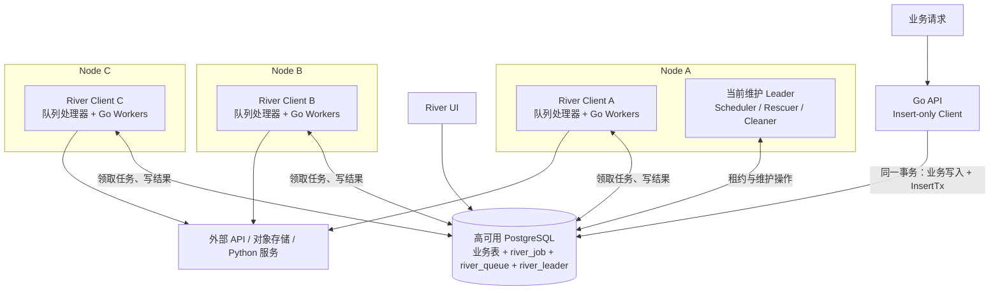
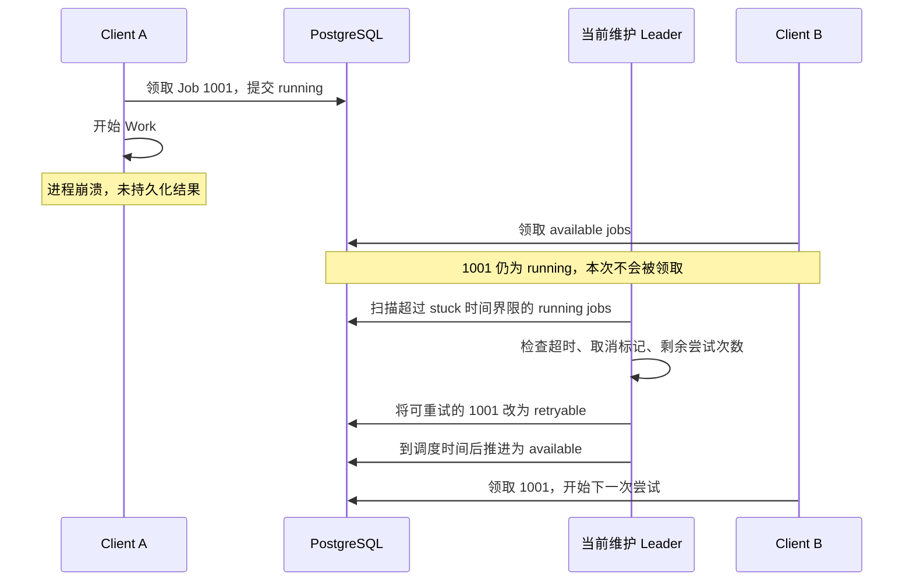

# River 任务归属原理：PostgreSQL Queue、SKIP LOCKED 与 Leader

River 内容分成四篇：

1. [第 1 篇](./051_river.md)；

2. **本文**；

3. [第 3 篇](./053_river_execution_recovery.md)；

4. [第 4 篇](./054_river_task_delivery_data_model.md)。

## 1. 三节点部署：谁领取任务，状态存在哪里

### 1.1 进程里有哪些组件

River 不需要先部署一套独立的 Frontend、History 和 Matching 服务。Go 应用创建 `river.Client`，注册 Worker，配置队列并调用 `Start`，就可以直接从数据库领取和执行任务。

| 组件 | 职责 | 生命周期和状态 |
|---|---|---|
| Client | 提供 Insert/InsertTx、管理队列处理和后台服务 | 嵌入应用进程；可以只插入、不执行 |
| 每队列 producer | 根据剩余容量拉取任务，创建执行器 | 进程内组件，维护当前活跃任务 |
| Job Executor / Worker | 反序列化参数，执行 Work，处理超时、错误和 panic | 每次尝试在 goroutine 中运行 |
| Completer | 将执行结果写回数据库，可合并批量写入 | 内存中的待写结果尚不是持久完成 |
| Notifier | 接收任务和控制通知，减少轮询延迟 | 通知用于唤醒，Job 表保存任务事实 |
| Elector / Maintenance | 选出维护 Leader，运行调度、回收、清理等服务 | 协调信息和待维护任务位于数据库 |

这里源码中的 `producer` 实际负责**取任务和安排执行**，不能按消息中间件术语把它理解为业务消息发送端。业务入队入口是 `Client.Insert` / `InsertTx`。实现入口见 [client.go](https://github.com/riverqueue/river/blob/a4cf56f7233ce1a84a4dc188d91bd09399522763/client.go) 与 [producer.go](https://github.com/riverqueue/river/blob/a4cf56f7233ce1a84a4dc188d91bd09399522763/producer.go)。

### 1.2 三节点总体架构图



三台机器运行对等的执行进程，API 可以独立部署，也可以与执行进程同机。三个 Client 都能领取同一队列的 Job；A 的维护 Leader 身份不会使它成为所有任务的转发入口。

任务没有分别复制到 A、B、C 的本地队列。数据库保存权威状态，PostgreSQL 的复制、备份和主库切换由数据库部署方案负责。应用增加到三个副本，不能补偿单实例数据库故障。

### 1.3 Job、Queue 与底层存储怎样对应

先看一个待生成视频的任务：

```text
业务记录：content_request.id = 42
Job：id = 1001
     kind = "prepare_content"
     queue = "media"
     args = {"request_id": 42}
     state = "available"
```

`kind` 决定用哪个 Worker 执行，`queue` 决定由哪些配置了该队列的 Client 竞争领取。`request_id` 是业务关联键，`id` 是 River Job 标识；它们不是同一个标识空间。

| 表或字段 | 数据形态 | 用途 |
|---|---|---|
| `river_job` | 每个 Job 一行，主键 `id` | 参数、状态、调度时间、尝试次数、错误和元数据 |
| `river_job.kind` / `args` | 类型名 + JSONB 参数 | 找 Worker、重建本次调用输入 |
| `river_job.queue` | 队列名称 | 领取查询的过滤条件 |
| `river_job.metadata` | JSONB | 应用元数据、步骤/游标进度、记录的输出等 |
| `river_queue` | 主键 `name` | 队列暂停状态、元数据和更新时间 |
| `river_leader` | PostgreSQL UNLOGGED 表，固定 name 的协调行 | 当前维护 Leader、当选时间、租约截止时间 |
| `river_migration` | Schema 迁移记录 | 记录已执行的迁移版本 |
| 业务表、对象存储 | 由应用定义 | 长期业务状态、审批单、媒体文件和最终结果 |

一个 Queue 不对应一张独立的 Job 表，也不对应一个固定节点。开源版这里没有 Temporal 的 `Workflow ID → History Shard → owner` 映射，也没有 Kafka 式分区副本分配。配置更多 Queue 主要是分开领取条件、执行容量和管理策略；它不会自动把数据库分片。

`river_leader` 的 UNLOGGED 定位与 `river_job` 不同：前者是可重新选举的协调信息，后者才是需要保留的任务状态。不能把 Leader 行当成任务可靠性的来源。表结构和查询可直接阅读 [river_job.sql](https://github.com/riverqueue/river/blob/a4cf56f7233ce1a84a4dc188d91bd09399522763/riverdriver/riverpgxv5/internal/dbsqlc/river_job.sql)、[river_queue.sql](https://github.com/riverqueue/river/blob/a4cf56f7233ce1a84a4dc188d91bd09399522763/riverdriver/riverpgxv5/internal/dbsqlc/river_queue.sql) 和 [river_leader.sql](https://github.com/riverqueue/river/blob/a4cf56f7233ce1a84a4dc188d91bd09399522763/riverdriver/riverpgxv5/internal/dbsqlc/river_leader.sql)。

### 1.4 多个节点怎样避免同时领取同一任务

PostgreSQL 路径中的核心是 `JobGetAvailable`。以下是保留关键逻辑的简化 SQL，不是可直接替换源码的版本：

```sql
WITH locked_jobs AS (
    SELECT id
    FROM river_job
    WHERE state = 'available'
      AND queue = $1
      AND scheduled_at <= now()
    ORDER BY priority, scheduled_at, id
    LIMIT $2
    FOR UPDATE SKIP LOCKED
)
UPDATE river_job AS j
SET state = 'running',
    attempt = j.attempt + 1,
    attempted_at = now()
FROM locked_jobs AS l
WHERE j.id = l.id
RETURNING j.*;
```

假设 A、B 同时取 `media` 队列：A 已经锁定的行会被 B 跳过，B 可以继续领取其他行。领取事务提交后，Job 已经是 `running`，普通领取查询就不会再次选中它。

**行锁只覆盖领取事务，不会一直持有到 HTTP 调用或视频渲染结束。** 后续执行靠 `running` 状态与结果更新衔接；进程崩溃后的恢复由 Rescuer 处理。因此，这个机制解决正常领取竞争，并不保证外部副作用只发生一次。

排序是 `priority → scheduled_at → id`，其中 priority 数字越小越优先。多节点、多个 goroutine、重试以及跳过锁定行都会影响实际开始和完成顺序，不能把它当成严格 FIFO 的业务顺序保证。依据见上述 `river_job.sql` 的 `JobGetAvailable`。

### 1.5 成员协调与维护 Leader 怎样确定

River 的这条执行路径不依赖 Ringpop 成员环。Client 只要连接到同一数据库和 Schema，就能竞争领取任务；需要集群协调的是“谁负责执行一份维护工作”。

选主过程可以概括为：

1. 开始执行任务的 Client 参与选举；只入队的 Client 不承担维护选主。
2. 在事务中删除已过期的 Leader 行，再尝试插入 `river_leader`。
3. 固定 `name` 的唯一约束使一个竞争者获得该协调行；其他 Client 继续正常执行任务。
4. Leader 周期性续租。续租 SQL 同时检查 `leader_id`、`elected_at` 和租约尚未过期，避免旧任期随意续写新任期。
5. 续租失败或超过本地安全期限后，停止本任期的维护职责；其他 Client 在租约过期后重新竞争。正常退出还会主动辞任并发送通知。

本地快照的默认选举周期为 5 秒，`leaderTTL()` 为“选举周期 + 10 秒”，默认租约为 15 秒。官方概念页仍有“五秒 TTL”的表述，本文采用固定提交的源码值；选举周期、租约长度和实际故障恢复时间需要分别理解。[选主源码](https://github.com/riverqueue/river/blob/a4cf56f7233ce1a84a4dc188d91bd09399522763/internal/leadership/elector.go)、[官方选主说明](https://riverqueue.com/docs/leader-election)。

维护 Leader 负责推进到期任务、生成周期任务、回收 stuck jobs、清理终态任务等。**失去维护 Leader 不等于整个队列马上停止执行**：其他 Client 仍可领取已满足条件的 `available` Job，但依赖维护服务的调度和回收可能延迟。

### 1.6 执行节点失效时怎样恢复

假设 Job 1001 被 A 领取，A 写入 `running` 后突然断电：



如果 A 同时是维护 Leader，还要先由剩余节点接替维护职责。B 不从 A 的内存或磁盘复制执行栈，而是读取 Job 参数、错误和已持久化的进度。

本地默认 `JobTimeout` 为 1 分钟，`RescueStuckJobsAfter` 为 1 小时，Rescuer 默认扫描间隔为 30 秒。它先按 `attempted_at` 找候选，再考虑 Worker 类型的超时设置等条件。因此“Leader 十几秒完成切换”不能推导出“崩溃任务十几秒后重跑”。长任务应根据实际最长执行时间调整这些参数；超时设为无限的任务在当前 Rescuer 判断中可能被跳过，不能假设所有 stuck job 都会自动回收。[配置](https://github.com/riverqueue/river/blob/a4cf56f7233ce1a84a4dc188d91bd09399522763/client.go)、[JobRescuer](https://github.com/riverqueue/river/blob/a4cf56f7233ce1a84a4dc188d91bd09399522763/internal/maintenance/job_rescuer.go)。
