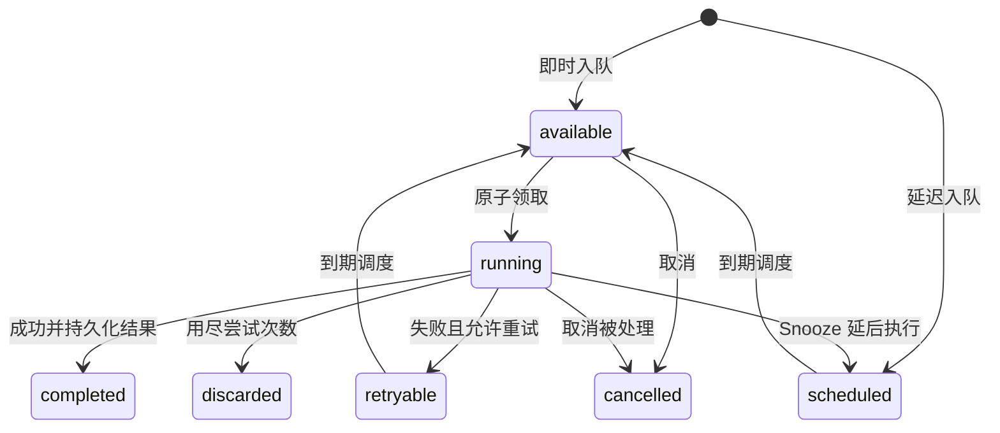

# River 执行与故障恢复

River 内容分成四篇：

1. [基础与架构](./051_river.md);

2. [任务分配与并发控制](./052_river_job_assignment.md);

3. **执行与故障恢复（本文）**;

4. [任务投递与状态变化](./054_river_task_delivery_data_model.md);

## 1. 一次状态转换怎样持久化

### 1.1 Job 状态机



这是主路径示意，省略了部分管理操作、短期 Snooze 优化与正常停机中断分支。Schema 还定义了 `pending`：普通领取 SQL 只选 `available`，不能因为存在 `pending` 状态，就推导出 OSS 已经内置跨 Job 依赖解析器。

Job 的参数、尝试次数、错误和时间字段都随记录保存在数据库中。它没有 Temporal 那种“通过完整 Event History 校验 Command 序列”的恢复过程，也没有恢复 goroutine 的内存快照。

### 1.2 完成任务与业务更新怎样原子提交

普通 Worker `return nil` 后，River 再把任务完成状态写入数据库。如果 Worker 已经提交业务更新，却在 River 完成状态落库前崩溃，任务之后仍可能重新执行。

当副作用都在同一数据库时，可以使用：

```text
BEGIN
  更新 content_request 为 waiting_review
  创建 approval_ticket
  JobCompleteTx：把当前 Job 标记为 completed
COMMIT
```

如果还要接续另一个 Job，可以把 `InsertTx(下一任务)` 放进同一事务。这使“当前业务结果、当前任务完成、下一任务入队”一起提交，适合实现简单串行链。每个函数和 SQL 的错误都必须检查，提交成功后 Worker 正常返回 nil。[JobCompleteTx 源码](https://github.com/riverqueue/river/blob/a4cf56f7233ce1a84a4dc188d91bd09399522763/job_complete_tx.go)。

这个事务不能包含第三方平台的 HTTP 提交结果。把发布 API 调用放进一个长数据库事务，也不会让两个系统自动具备原子提交能力。

### 1.3 LISTEN/NOTIFY 为什么不会成为任务丢失点

PostgreSQL 通知用于提示 Client“现在可能有新工作”。Client 醒来后仍然查询 `river_job`；通知本身不是唯一的任务载体。连接中断或通知错过后，周期轮询可以再次发现已提交的 Job。

本地默认 `FetchPollInterval` 为 1 秒，`FetchCooldown` 为 100 毫秒。它们影响取任务节奏，并不是端到端延迟承诺：数据库负载、队列容量和 Worker 耗时仍会影响开始时间。依据见 [Client 配置注释](https://github.com/riverqueue/river/blob/a4cf56f7233ce1a84a4dc188d91bd09399522763/client.go)。

### 1.4 任务记录不是永久业务历史

终态任务达到保留期后会被 Cleaner 删除。`RecordOutput` 将输出写到 Job 的 metadata，而且通常随执行结果延后持久化。因此长期产物、账务记录、审批审计和用户可见状态应另有业务存储；不能仅保存在会清理的 Job 行里。依据见 [RecordOutput](https://github.com/riverqueue/river/blob/a4cf56f7233ce1a84a4dc188d91bd09399522763/recorded_output.go) 与 [JobCleaner](https://github.com/riverqueue/river/blob/a4cf56f7233ce1a84a4dc188d91bd09399522763/internal/maintenance/job_cleaner.go)。

## 2. 分步骤恢复：Resumable Jobs 到底恢复什么

### 2.1 普通失败后，从已记录的步骤继续

一个内容准备任务可以定义三个命名步骤：

```go
func (w *PrepareContentWorker) Work(
    ctx context.Context, job *river.Job[PrepareContentArgs],
) error {
    river.ResumableStep(ctx, "generate_script", nil, func(ctx context.Context) error {
        return w.generateScript(ctx, job.Args.RequestID)
    })
    river.ResumableStep(ctx, "render_media", nil, func(ctx context.Context) error {
        return w.renderMedia(ctx, job.Args.RequestID)
    })
    river.ResumableStep(ctx, "request_review", nil, func(ctx context.Context) error {
        return w.requestReview(ctx, job.Args.RequestID)
    })
    return nil
}
```

这是 Worker 片段，三个业务方法需自行实现，结果应写入可重新读取的业务存储。假设 `generate_script` 成功、`render_media` 返回错误，River 会停止后续步骤，处理步骤错误并保存进度。下一次尝试重新进入 Work 时，跳过已记录完成的步骤，继续渲染。

步骤名必须在 Worker 内唯一，并在升级时保持兼容；步骤外的普通代码仍会在每次尝试执行。不要把下一步所需的唯一结果只存在局部变量中，因为重试时前一步可能被跳过。[Resumable 实现](https://github.com/riverqueue/river/blob/a4cf56f7233ce1a84a4dc188d91bd09399522763/resumable.go)。

### 2.2 强杀进程时，默认检查点可能还没有落库

需要区分两个时刻：

```text
步骤函数成功返回
    ↓
进程内记录 CompletedStep
    ↓
Worker 返回，River 持久化结果与进度
```

默认并不是每个步骤成功后立即提交一次数据库事务。如果生成文案已产生外部结果，但进程在 Worker 返回前被强杀，那么进程内的步骤进度可能丢失；恢复后仍可能重复生成文案。`ResumableSetCursor` 的普通游标记录也有这个边界。

需要更强的检查点时，在步骤回调内调用 `ResumableSetStepTx`，或在游标步骤内调用 `ResumableSetStepCursorTx`，并提交事务。这样可以让业务库更新与进度一起持久化。步骤检查点应在该步骤需要保证完成的工作之后提交；外部 API 仍需自己的幂等设计。[事务检查点源码](https://github.com/riverqueue/river/blob/a4cf56f7233ce1a84a4dc188d91bd09399522763/resumable_step_tx.go)、[官方 Durable checkpoints 说明](https://riverqueue.com/docs/resumable-jobs#durable-checkpoints-with-resumablesetsteptx)。

### 2.3 与 Temporal 恢复机制的区别

| 问题 | River OSS Resumable Job | Temporal Workflow |
|---|---|---|
| 主要恢复依据 | Job 状态、步骤名、游标和业务数据 | Event History 与确定性代码 |
| 再次运行 | 重新进入 Work，按已保存进度跳过步骤 | 重放 Workflow，以历史结果恢复执行 |
| 步骤能否直接访问外部系统 | 可以，Worker 就是副作用执行代码 | Workflow 不直接执行副作用，交给 Activity |
| 步骤如何分布式执行 | 单个 Job 内仍在当前 Worker 执行 | Activity 可以分派到不同 Worker |
| 长期外部等待 | OSS 通常用业务状态、后续 Job 或 Snooze 建模 | 原生 Signal/Update 与持久 Timer |
| 改代码的约束 | 保持参数、步骤名和业务进度兼容 | 还需保持重放确定性和历史兼容 |

River 的方式更接近“显式检查点驱动的再次尝试”。两者都不能仅靠执行框架消除外部副作用重复，相关 Temporal 机制见 [持久化与恢复章节](./021_temporal.md)。

## 3. 故障、重试与幂等边界

### 3.1 先区分几类失败

| 故障 | River 的处理 | 应用责任 |
|---|---|---|
| Work 返回错误或 panic | 按剩余次数安排重试，耗尽后 discarded | 区分可恢复错误和永久错误 |
| 进程突然死亡 | Job 留在 running，满足条件后由 Rescuer 回收 | 配好回收时间、最长执行时间与幂等 |
| 正常停止但任务未结束 | Stop 等待；取消退出有专门中断处理 | 留足退出时间，传播 context 取消 |
| 外部提交成功、结果未落库 | 之后可能再次尝试同一 Job | 用外部幂等键、查单或补偿 |
| 数据库不可用 | 领取和状态更新受阻，恢复后重试相关操作 | 数据库 HA；处理提交结果不确定 |

本地 v0.44.0 之后的正常停机中断路径，能够把被停机取消的任务重新变为 `available`，并恢复本次尝试前的 attempt 计数；这和硬崩溃后等待 Rescuer 是两条不同路径。不能把所有取消都解释为普通业务失败。[CHANGELOG](https://github.com/riverqueue/river/blob/a4cf56f7233ce1a84a4dc188d91bd09399522763/CHANGELOG.md)。

### 3.2 重试、Snooze 与取消

默认最大尝试次数为 25。默认退避大致按失败次数的四次方增加，并带抖动；可以通过 Worker `NextRetry` 或 Client `RetryPolicy` 定制。永久失败可以用 `JobCancel` 表达取消；任务暂时还不该执行时，可返回 `JobSnooze(duration)`，释放执行槽位后再调度，而不是占着 goroutine 睡几个小时。[重试入口](https://github.com/riverqueue/river/blob/a4cf56f7233ce1a84a4dc188d91bd09399522763/retry_policy.go)、[错误与 Snooze 定义](https://github.com/riverqueue/river/blob/a4cf56f7233ce1a84a4dc188d91bd09399522763/error.go)。

Go context 取消是协作式的。Worker 或下游库不检查取消，不会因为框架发出取消信号就自动停止外部操作。回收阈值也不能设得短于正常业务执行时间，否则仍在工作的任务可能被当成 stuck 再执行。

### 3.3 Unique Job 不能替代业务幂等

UniqueOpts 可以按参数、时间窗口、队列和状态等定义入队唯一性；当前默认实现利用唯一键与数据库唯一约束，部分特殊配置有兼容路径。它解决的是“符合唯一条件的 Job 是否重复插入”，不是“同一个 Job 的多次尝试是否重复调用发布 API”。[UniqueOpts 源码](https://github.com/riverqueue/river/blob/a4cf56f7233ce1a84a4dc188d91bd09399522763/insert_opts.go)。

发布场景中，应使用稳定的 `request_id + platform + content_version` 作为业务幂等依据。外部平台支持幂等键就直接传入；不支持则持久化外部请求和资源标识、重试前查状态，并设计结果无法判定时的人工处理路径。任务清理之后，不能依赖旧 Job 行继续承担永久去重。
