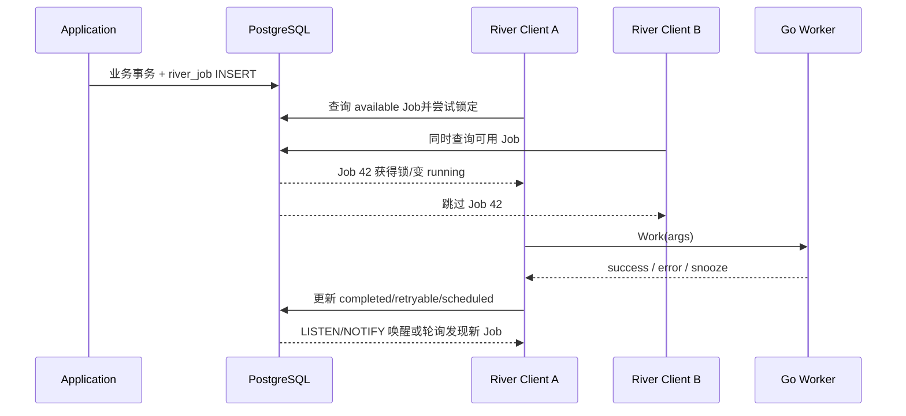

# River 任务投递与状态变化

River 内容分成四篇：

1. [基础与架构](./051_river.md);

2. [任务分配与并发控制](./052_river_job_assignment.md);

3. [执行与故障恢复](./053_river_execution_recovery.md);

4. **任务投递与状态变化（本文）**;

## 1. 完整时序图



## 2. Worker 与谁连接

River Worker 是注册在 River Client 进程中的 Go 函数，不是独立远程 Worker。River Client 使用 PostgreSQL连接池查询和锁定 Job；LISTEN/NOTIFY 只用于尽快唤醒，定期轮询保证通知丢失时仍能发现任务。

## 3. Job 怎样匹配 Worker

Client 按 Queue、Kind、scheduled_at、priority 和状态筛选任务，通过数据库锁与 `SKIP LOCKED` 一类并发领取机制让一个 Client 获得本次执行权。取得 Job 后，再按 Kind 查找本进程注册的 Worker。Queue 的 MaxWorkers 是每个 Client 的本地并发限制，不是集群全局固定分片。

## 4. 沿图看数据模型

```yaml
river_job:
  id: 42
  kind: generate_script
  queue: content
  args: {article_id: 99}
  state: available
  attempt: 0
  max_attempts: 5
  scheduled_at: 2024-10-11T08:00:00+08:00
  attempted_by: []
```

| 步骤 | 关键输入 | river_job 变化 | 后续动作 |
|---|---|---|---|
| 事务入队 | Kind、Args、Queue、Unique/时间选项 | INSERT available/scheduled | 提交后通知 Client |
| 竞争领取 | Queue、Kind、容量、当前时间 | running、attempt+1、attempted_by | 一个 Client 调用 Worker |
| 成功 | Job ID、完成时间 | completed/finalized_at | 不再领取 |
| 返回错误 | Error、Retry Policy | retryable、更新 scheduled_at/errors | 到期后再次领取 |
| Snooze | 延迟时间 | scheduled | 延迟后重新领取 |
| Client 崩溃 | 心跳/租约维护信息 | 由救援逻辑恢复可领取状态 | 其他 Client 接管 |

## 5. 谁推进状态

River Client 同时承担领取器和单 Job 状态推进者；PostgreSQL 是权威队列与状态存储。它不像 Temporal 那样由 Event History 重放整个函数，也没有独立 Matching 服务。多步骤业务恢复必须使用 Resumable Jobs、拆分 Job 或业务状态表显式建模。
