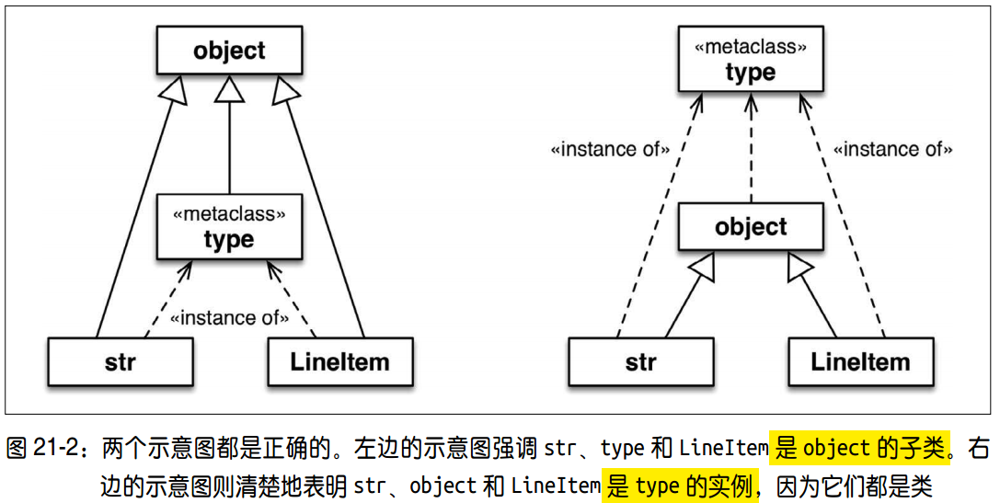
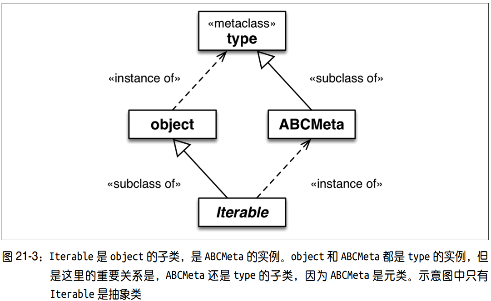

# 6.3 类元编程

本章内容:
  - 类工厂
    - 元类
    - exec 函数
  - 类装饰器
  - 导入时和运行时
  - 类作为对象


## 1. 对象之间的关系
元类:
  - 定义: 创建类的类，类是元类的实例
  - 特性: 超类的元类会被子类继承，因此元类可以定制类的层次结构

### 1.1 类，object，type:

- 类的角度: 所有类包括 type 都是 object 类的子类
- 实例角度: Python 中大多数内置的类和用户定义的类都是 type 类的实例，包括 type 和 object
- object 与 type:
  - object 是 type 的实例，而 type 是 object 的子类
  - type 是自身的实例

### 1.2 元类与type

  - 所有类都直接或间接地是 type 的实例
  - 只有元类同时也是 type 的子类，从 type 类继承了构建类的能力(如ABCMeta)

```python
>>> import collections
>>> collections.Iterable.__class__  # 所有抽象基类的元类都是 abc.ABCMeta
<class 'abc.ABCMeta'>
>>> import abc
>>> abc.ABCMeta.__class__
<class 'type'>
>>> abc.ABCMeta.__mro__
(<class 'abc.ABCMeta'>, <class 'type'>, <class 'object'>)
```    

## 2. 元类的使用
### 2.1 type
  - 作为函数: 调用 type(my_object)，获取对象所属的类，与 my\_object.\_\_class\_\_ 相同
  - 作为类: 调用 type(name,bases,dict) 可以新建一个类
    - name: 类的名称
    - base: 超类的元组
    - dict: 字典，指定新类的属性名和值

    ```python
    # 以下创建类的效果等同
    MyClass = type('MyClass', (MySuperClass, MyMixin),
                   {'x':  42, 'x2':  lambda self:  self.x * 2})

    class MyClass(MySuperClass, MyMixin):
        x = 42

        def x2(self):
            return self.x * 2
    ```

### 2.2 自定义元类
```python
# 定义元类
class EntityMeta(type):
    """Metaclass for business entities with validated fields"""

    @classmethod
    def __prepare__(cls, name, bases):
        return collections.OrderedDict()  # <1>

    def __init__(cls, name, bases, attr_dict):
        super().__init__(name, bases, attr_dict)
        cls._field_names = []
        for key, attr in attr_dict.items():
            if isinstance(attr, Validated):
                type_name = type(attr).__name__
                attr.storage_name = '_{}#{}'.format(type_name, key)
                cls._field_names.append(key)  # <4>

# 使用元类
class Entity(metaclass=EntityMeta):
    """Business entity with validated fields"""

    @classmethod
    def field_names(cls):   # <5>
        for name in cls._field_names:
            yield name

# 使用元类
class LineItem(Entity):
    description = model.NonBlank()
    weight = model.Quantity()
    price = model.Quantity()
```
1. \_\_prepare\_\_ 方法详见下
2. 元类继承自 type 类
3. 元类初始化参数:
  - cls: 要初始化的类对象
  - name、bases、dic: 与构建类时传给 type 的参数相同
4. 把类链接到元类:
  - Python3 中使用 `class Entity(metaclass=EntityMeta)`
  - Pytohn2 中使用 ` __metaclass__ = EntityMeta`

### 2.3 特殊方法\_\_prepare\_\_
\_\_prepare\_\_(cls, name, bases):
  - 版本: Python3
  - 目的: 知道类的属性定义的顺序
  - 背景:
    - type 构造方法及元类的 \_\_new\_\_ 和 \_\_init\_\_ 方法都会收到类属性名到值的映射
    - 但是映射是字典；也就是说，元类或类装饰器获得映射时，属性在类定义体中的顺序已经丢失了
  - 调用:
    - 解释器调用元类的 \_\_new\_\_ 方法之前会先调用 \_\_prepare\_\_ 方法
    - 元类构建新类时，\_\_prepare\_\_ 返回的映射会传给 \_\_new\_\_ 再传给 \_\_init\_\_
    - **解释器会在 \_\_prepare\_\_ 返回的映射中填充类属性**
  - 语法:
    - 这个特殊方法只在元类中有用
    - 而且必须声明为类方法(即，要使用 @classmethod 装饰器定义)
  - 参数:
    - cls: 元类
    - name: 类的名称
    - bases: 基类组成的元组
  - 返回: 必须是映射
  - 实例: 见上


## 3. 类工厂函数
###  3.1 type
```python
def record_factory(cls_name, field_names):
    try:
        field_names = field_names.replace(',', ' ').split()  # <1>
    except AttributeError:   # no .replace or .split
        pass  # assume it's already a sequence of identifiers
    field_names = tuple(field_names)  # <2>

    def __init__(self, *args, **kwargs):   # <3>
        attrs = dict(zip(self.__slots__, args))
        attrs.update(kwargs)
        for name, value in attrs.items():
            setattr(self, name, value)

    def __iter__(self):   # <4>
        for name in self.__slots__:
            yield getattr(self, name)

    def __repr__(self):   # <5>
        values = ', '.join('{}={!r}'.format(*i) for i
                           in zip(self.__slots__, self))
        return '{}({})'.format(self.__class__.__name__, values)

    cls_attrs = dict(__slots__ = field_names,  # <6>
                     __init__  = __init__,
                     __iter__  = __iter__,
                     __repr__  = __repr__)

    return type(cls_name, (object,), cls_attrs)  # <7>
```

### 3.2 exec
collections.namedtuple 实现
  - 实现: 使用了 exec 函数
  - 目的: 为了让生成的类代码能通过 .\_source 属性获取
  - 文档:
    - https://hg.python.org/cpython/file/3.4/Lib/collections/__init__.py#l236
    - https://docs.python.org/3/library/collections.html#collections.somenamedtuple._source
  - 方法:
    - 先声明一个 \_class\_template 变量，其值是字符串形式的源码模板；
    - 然后在 namedtuple 函数中调用 \_class\_template.format(...) 方法，填充模板里的空白；
    - 最后，使用内置的 exec 函数计算得到的源码字符串

exec(eval) 缺点: 如果接收的字符串(或片段)来自不可信的源，那么会带来严重的安全风险


## 4. 类装饰器
类装饰器
  - 定义: 参数为类对象的函数，返回原来的类或修改后的类
  - 作用: 创建类时定制类
  - 缺点:
    - 只对直接依附的类有效
    - 被装饰的类的子类可能继承,也可能不继承装饰器所做的改动，具体情况视改动的方式而定

```python
def entity(cls):
    for key, attr in cls.__dict__.items():
        if isinstance(attr, Validated):
            type_name = type(attr).__name__
            attr.storage_name = '_{}#{}'.format(type_name, key)  # <4>
    return cls

@model.entity
class LineItem:
    description = model.NonBlank()
    weight = model.Quantity()
    price = model.Quantity()
```

## 5. 导入时与运行时
Python 解释器什么时候计算各个代码块
  - 导入时，解释器会从上到下一次性解析完 .py 模块的源码，然后生成用于执行的字节码。如果句法有错误，就在此时报告。
  - 如果本地的 \_\_pycache\_\_ 文件夹中有最新的 .pyc 文件，解释器会跳过上述步骤，因为已经有运行所需的字节码
  - import语句，它不只是声明，在进程中首次导入模块时，还会运行所导入模块中的全部顶层代码 ——
  以后导入相同的模块则使用缓存，只做名称绑定
  - 模块中的顶层代码可以做任何事，包括通常在"运行时"做的事，例如连接数据库
  - 因此，"导入时"与"运行时"之间的界线是模糊的:  import 语句可以触发任何"运行时"行为

函数:
  - 导入模块时，解释器会执行顶层的 def 语句，编译函数的定义体，把函数对象绑定到对应的全局名称上，
  但不会执行函数的定义体
  - 意味着解释器在导入时定义顶层函数，但是仅当在运行时调用函数时才会执行函数的定义体

类:
  - 解释器会执行每个类的定义体，甚至会执行嵌套类的定义体。
  - 执行类定义体的结果是，定义了类的属性和方法，并构建了类对象。
  - 从这个意义上理解，类的定义体属于"顶层代码"，因为它在导入时运行
  - 解释器先计算类的定义体，然后调用依附在类上的装饰器函数

## 6. 类作为对象
文档:  https://docs.python.org/3/library/stdtypes.html#special-attributes

cls.\_\_bases\_\_
   - 值: 由类的基类组成的元组

cls.\_\_qualname\_\_
  - Python 3.3 新引入的属性
  - 值: 类或函数的限定名称，即从模块的全局作用域到类的点分路径
  - 文档: PEP 3155—Qualified name for classes and functions  
  https://www.python.org/dev/peps/pep-3155/

cls.\_\_subclasses\_\_()
  - 返回一个列表，包含内存里现存的子类
  - 实现: 使用弱引用，防止在超类和子类之间出现循环引用
  - 附注: 子类在 \_\_bases\_\_ 属性中储存指向超类的强引用

cls.mro()
  - 构建类时，如果需要获取储存在类属性 \_\_mro\_\_ 中的超类元组，解释器会调用这个方法
  - 元类可以覆盖这个方法，定制要构建的类解析方法的顺序

cls.\_\_init\_subclass\_\_()
  - 作用: 让普通的类(即，不是元类)定制子类的初始化
  - 版本: Python36

## 延伸阅读
### Python:
Customizing class creation
  -  https://docs.python.org/3/reference/datamodel.html#metaclasses

type 类
  -  https://docs.python.org/3/library/functions.html#type

Special Attributes
  - https://docs.python.org/3/library/stdtypes.html#special-attributes

types 模块
  - https://docs.python.org/3/library/types.html
  - 说明了 Python3.3 引入的两个新函数，这两个函数用于辅助类元编程:
    - types.new_class(...)
    - types.prepare_class(...)

Class Decorators
  - https://www.python.org/dev/peps/pep-3129/

 \_\_prepare\_\_
    - PEP 3115—Metaclasses in Python3000
    - https://www.python.org/dev/peps/pep-3115/

\_\_init\_subclass\_\_
  - 作用: 让普通的类(即，不是元类)定制子类的初始化
  - 版本: Python36

### blog:
Class Decorators:  Radically Simple 的演讲
  - https://www.youtube.com/watch?v=cAGliEJV9_o

Meta-classes Made Easy: Eliminating self with Metaclasses
  - 副标题("借助元类去掉 self")
  - http://www.voidspace.org.uk/python/articles/metaclasses.shtml

Unifying types and classes in Python 2.2
  - https://www.python.org/download/releases/2.2.3/descrintro/
  - 这篇文章也适用于 Python 3，谈到了后来称为"新式类"的语义，包括描述符和元类

### 实用工具
MacroPy
  - https://github.com/lihaoyi/macropy

### 书籍:
《 Python 技术手册(第2版)》

《 Python Cookbook(第 3 版)中文版》

《Putting Metaclasses to Work:  a New Dimension in Object-Oriented Programming》

## 附注
1. Python 把函数当作一等对象，这为高阶函数铺平了道路。
2. 描述符和高阶函数合在一起实现，使得函数和方法的统一成为可能。
3. 函数的 \_\_get\_\_ 方法能即时生成方法对象，把实例绑定到 self 参数上。这种做法相当优雅
