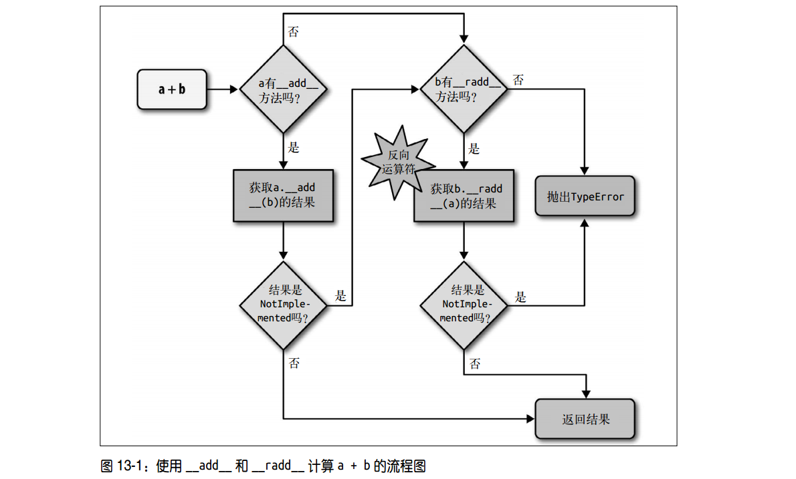

# 3.6 运算符重载
本章将讨论:
  - Python 如何处理中缀运算符中不同类型的操作数
  - 使用鸭子类型或显式类型检查处理不同类型的操作数
  - 中缀运算符如何表明自己无法处理操作数
  - 众多比较运算符（如 ==、 >、 <=，等等）的特殊行为
  - 增量赋值运算符（如 +=）的默认处理方式和重载方式

## 1. 运算符重载基础
Python 限制:
  - 不能重载内置类型的运算符
  - 不能新建运算符，只能重载现有的
  - 某些运算符不能重载——is、 and、 or 和 not（不过位运算符 &、 | 和 ~ 可以）

运算符的基本规则:
  1. 就地运算符(增量赋值运算符)必须返回 self
  2. 除就地运算符外，其他运算符**始终返回一个新对象**，即要创建并返回合适类型的新实例


## 2. 一元运算符
### 2.1 一元运算符简介
  - 文档:  Python 语言参考手册，"6.6. Unary arithmetic and bitwise operations"一节
  - 链接:  https://docs.python.org/3/reference/expressions.html#unary-arithmetic-and-bitwise-operations

|运算符|方法|说明|示例|
|: ---|: ---|: ---|: ---|
|-|\_\_neg\_\_|一元取负算术运算符|如果 x 是 -2，那么 -x == 2|
|+|\_\_pos\_\_|一元取正算术运算符|通常 x == +x，但也有一些例外|
|~|\_\_invert\_\_|对整数按位取反，定义为 ~x == -(x+1)|如果 x 是 2，那么 ~x == -3|
|abs()|\_\_abs\_\_|取绝对值|...|

### 2.2 x 和 +x 何时不相等
decimal.Decimal 类:
  - 场景: 在不同精度的上下文中计算 +x，那么 x != +x
  - 原因: 虽然每个 +one_third 表达式都会使用 one_third 创建一个新 Decimal 实例，但是
  会使用当前算术运算上下文的精度

```python
>>> import decimal
>>> ctx = decimal.getcontext() #  获取当前全局算术运算的上下文引用
>>> ctx.prec = 40
>>> one_third = decimal.Decimal('1') / decimal.Decimal('3')
>>> one_third
Decimal('0.3333333333333333333333333333333333333333')
>>> one_third == +one_third
True
>>> ctx.prec = 28
>>> one_third == +one_third
False
>>> +one_third
Decimal('0.3333333333333333333333333333')
```

collections.Counter:
  - 加法运算符: Counter 相加时，负值和零值计数会从结果中剔除
  - 一元运算符: 等同于加上一个空Counter，因此产生一个新的 Counter 且仅保留大于零的计数器
  - 文档:  https://docs.python.org/3/library/collections.html#collections.Counter

```python
>>> ct = Counter('abracadabra')
>>> ct
Counter({'a':  5, 'r':  2, 'b':  2, 'd':  1, 'c':  1})
>>> ct['r'] = -3
>>> ct['d'] = 0
>>> ct
Counter({'a':  5, 'b':  2, 'c':  1, 'd':  0, 'r':  -3})
>>> +ct
Counter({'a':  5, 'b':  2, 'c':  1})
```

## 3. 中缀运算符
|运算符|正向方法|反向方法|就地方法|说明|
|: ---|: ---|: ---|: ---|: ---|
|+|\_\_add\_\_|\_\_radd\_\_|\_\_iadd\_\_|加法或拼接|
|-|\_\_sub\_\_|\_\_rsub\_\_|\_\_isub\_\_|减法|
|*|\_\_mul\_\_|\_\_rmul\_\_|\_\_imul\_\_|乘法或重复复制|
|/|\_\_truediv\_\_|\_\_rtruediv\_\_|\_\_itruediv\_\_|除法|
|//|\_\_floordiv\_\_|\_\_rfloordiv\_\_|\_\_ifloordiv\_\_|整除|
|%|\_\_mod\_\_|\_\_rmod\_\_|\_\_imod\_\_|取模|
|divmod()|\_\_divmod\_\_|\_\_rdivmod\_\_|\_\_idivmod\_\_|返回由整除的商和模数组成的元组|
|**,pow()|\_\_pow\_\_|\_\_rpow\_\_|\_\_ipow\_\_|取幂 *|
|@|\_\_matmul\_\_|\_\_rmatmul\_\_|\_\_imatmul\_\_|矩阵乘法 #|
|&|\_\_and\_\_|\_\_rand\_\_|\_\_iand\_\_|位与|
|\|\_\_or\_\_|\_\_ror\_\_|\_\_ior\_\_|位或|
|^|\_\_xor\_\_|\_\_rxor\_\_|\_\_ixor\_\_|位异或|
|<<|\_\_lshift\_\_|\_\_rlshift\_\_|\_\_ilshift\_\_|按位左移|
|>>|\_\_rshift\_\_|\_\_rrshift\_\_|\_\_irshift\_\_|按位右移|

### 3.1 中缀运算符分派机制
** a + b 执行步骤**
1. 如果 a 有 \_\_add\_\_ 方法，且返回值不是 NotImplemented，调用 a.\_\_add\_\_(b)返回结果
2. 如果 a 没有 \_\_add\_\_ 方法，或者调用 \_\_add\_\_ 方法返回 NotImplemented，检查 b 有没有
\_\_radd\_\_ 方法，如果有，而且没有返回 NotImplemented，调用 b.\_\_radd\_\_(a)，然后返回结果
3. 如果 b 没有 \_\_radd\_\_ 方法，或者调用 \_\_radd\_\_ 方法返回 NotImplemented，抛出 TypeError，
并在错误消息中指明操作数类型不支持
4. 说明:
  - 右向（right）特殊方法(又称反向方法)提供了一种后备机制
  - 如果中缀运算符方法抛出异常，就会终止运算符分派机制
  - 一般来说，如果中缀运算符的正向方法只处理与 self 属于同一类型的操作数，
  那就无需实现对应的反向方法，因为按照定义，反向方法是为了处理类型不同的操作数



**NotImplemented 和 NotImplementedError**
  - NotImplemented:
    - 特殊的单例值
    - 如果中缀运算符特殊方法不能处理给定的操作数，那么要把它返回(return)给解释器
  - NotImplementedError:
    - 是一种异常
    - 抽象类中的占位方法把它抛出(raise)，提醒子类必须覆盖

### 3.2 加法运算符 + 示例
```python
def __add__(self, other):
    try:
        pairs = itertools.zip_longest(self, other, fillvalue=0.0)
        return Vector(a + b for a, b in pairs)
    except TypeError:
        return NotImplemented

def __radd__(self, other):
    return self + other
```
示例分析:
  - \_\_radd\_\_ 直接委托 \_\_add\_\_，前提是运算符可交换
  - 如果由于类型不兼容而导致运算符特殊方法无法返回有效的结果，那么应该返回 NotImplemented，
  而不是抛出 TypeError，这样另一个操作数所属的类型还有机会执行运算，即Python 会尝试调用反向方法
  - 如果反向方法返回 NotImplemented，那么 Python 会抛出 TypeError，并返回一个标准的错
误消息，例如" unsupported operand type(s) for +:  Vector and str"
  - 为了遵守鸭子类型精神，不能测试 other 操作数的类型，或者它的元素的类型。应该要捕获异常，
  然后返回 NotImplemented

### 3.2 乘法运算符 * 示例
```python
def __mul__(self, scalar):
    if isinstance(scalar, numbers.Real):
        return Vector(n * scalar for n in self)
    else:
        return NotImplemented

def __rmul__(self, scalar):
    return self * scalar
```
示例分析:
  - 白鹅类型的实际运用: 显式检查抽象类型 numbers.Real 抽象基类
  - numbers.Real 抽象基类涵盖了我们所需的全部数值类型，而且还支持以后声明为 numbers.Real
抽象基类的真实子类或虚拟子类的数值类型
  - 鸭子类型更灵活，但显式检查更能预知结果，通过检查抽象基类在灵活性和安全性之间做了很好的折中
  - decimal.Decimal 没有把自己注册为 numbers.Real 的虚拟子类。
  因此， Vector 类不会处理 decimal.Decimal 数字


### 3.3 特殊运算符说明
**pow(x, y[, z])**
  - 两个参数 == x**y
  - 三个参数 == (x**y) % z，但 pow() 函数更高效

**@ 运算符**
  - 版本: Python35 引入
  - 作用: 矩阵乘法，点积

## 4. 比较运算符
### 4.1 比较运算符分派机制
分派机制对比:
  - 相似: 与中缀运算符分配机制类似，正向方法返回NotImplemented，调用反向方法
  - 区别:
    1. 正向和反向调用使用的是同一系列方法
      - \_\_eq\_\_ 方法，只是把参数对调了；
      - 正向的 \_\_gt\_\_ 方法调用的是反向的 \_\_lt\_\_ 方法，并把参数对调
    2. 对 == 和 != 来说，如果反向调用失败， Python 会比较对象的 ID，而不抛出 TypeError

|分组|中缀运算符|正向方法调用|反向方法调用|后备机制|
|: ---|: ---|: ---|: ---|: ---|
|相等性|a == b|a.\_\_eq\_\_(b)|b.\_\_eq\_\_(a)|返回 id(a)==id(b)|
|相等性|a != b|a.\_\_ne\_\_(b)|b.\_\_ne\_\_(a)|返回 not(a==b)|
|排序|a > b|a.\_\_gt\_\_(b)|b.\_\_lt\_\_(a)|抛出 TypeError|
|排序|a < b|a.\_\_lt\_\_(b)|b.\_\_gt\_\_(a)|抛出 TypeError|
|排序|a >= b|a.\_\_ge\_\_(b)|b.\_\_le\_\_(a)|抛出 TypeError|
|排序|a <= b|a.\_\_le\_\_(b)|b.\_\_ge\_\_(a)|抛出 TypeError|

版本差异:
  - \_\_ne\_\_
    - Python 3 的后备机制是对 \_\_eq\_\_ 结果的取反，因此对于 != 运算符，无需重载
    - Python 2 不是如此
  - 比较运算符
    - Python 3 抛出 TypeError，并把错误消息设为 'unorderable types:  int() < tuple()
    - Python 2 中，这些比较的结果很怪异，会考虑对象的类型和 ID，而且无规律可循


## 5. 就地运算符
分派机制:
  1. 如果类没有实现就地运算符，增量赋值运算符只是语法糖:  a += b 的作用与 a = a + b 一样，
  对不可变类型来说，这是预期的行为，而且，如果定义了\_\_add\_\_ 方法，不用编写额外的代码， += 就能使用
  2. 如果类实现了就地运算符方法，会就地修改左操作数，而不会创建新对象作为结果，
  不可变类型，一定不能实现就地特殊方法

\+ 与 +=:
  - \+ 必需返回类的新实例，+= 必须返回 self，即实例本身
  - 与 + 相比， += 运算符对第二个操作数更宽容，因为
    - \+ 运算符的两个操作数必须是相同类型，如若不然，结果的类型可能让人摸不着头脑
    - 而 += 的情况更明确，因为就地修改左操作数，所以结果的类型是确定的

```python
>>> a = [1,2]
>>> a + (3, 4)      # + 要求两个操作数属于同一类型
Traceback (most recent call last):
  File "/usr/lib/python2.7/site-packages/IPython/core/interactiveshell.py", line 2882, in run_code
    exec(code_obj, self.user_global_ns, self.user_ns)
  File "<ipython-input-24-6ab1cfc1ec6f>", line 1, in <module>
    a + (3, 4)
TypeError:  can only concatenate list (not "tuple") to list
>>> a += (3, 4)     # += 的右操作数可以是任何可迭代对象
>>> a
[1, 2, 3, 4]
```

## 延伸阅读
### Python:
运算符特殊方法
  - Data Model https://docs.python.org/3/reference/datamodel.html

numbers 模块
  - 9.1.2.2. Implementing the arithmeticoperations 一节
  - https://docs.python.org/3/library/numbers.html#implementing-the-arithmeticoperations

functools.total_ordering
  - 作用: 能为只定义了几个比较运算符的类自动生成全部比较运算符
  - 文档: https://docs.python.org/3/library/functools.html#functools.total_ordering

### blog:
What’s New inPython 3.0
  - https://docs.python.org/3/whatsnew/3.0.html#operators-and-specialmethods

运算符方法分派机制
  - 这两篇论文深入分析了动态类型语言（如 Smalltalk、 Python 和 Ruby）的多态
    1. A Simple Technique for Handling Multiple Polymorphism
    https://wiki.illinois.edu//wiki/download/attachments/273416327/ingalls.pdf
    2. Arithmetic and Double Dispatching in Smalltalk-80 https://wiki.illinois.edu//wiki/download/attachments/273416327/double-dispatch.pdf
  - Python 没有使用这两篇论文中所述的双重分配处理运算符， Python 使用的正向运算符和反
  向运算符更便于用户定义的类支持双重分派，但是这种方式需要解释器做些特殊处理

### 实用工具  

### 书籍:
《 Python Cookbook（第 3 版）中文版》
  - "9.20 通过函数注解来实现方法重载"秘笈使用一些高级元编程（涉及元类）通过函数注解实现了基于类型的分派

《 Python Cookbook（第 2 版）中文版》
  - 2.13 节，展示了如何重载 << 运算符，在 Python 中模仿 C++ 的 iostream 句法

## 附注
运算符重载
  - 对极为重视性能和安全的低级系统语言而言，不支持运算符重载这无疑是正确的决定
  - 但是，重载的运算符，如果使用得当，的确能让代码更易于阅读和编写。对现代的高级语言来说，这是个好功能
