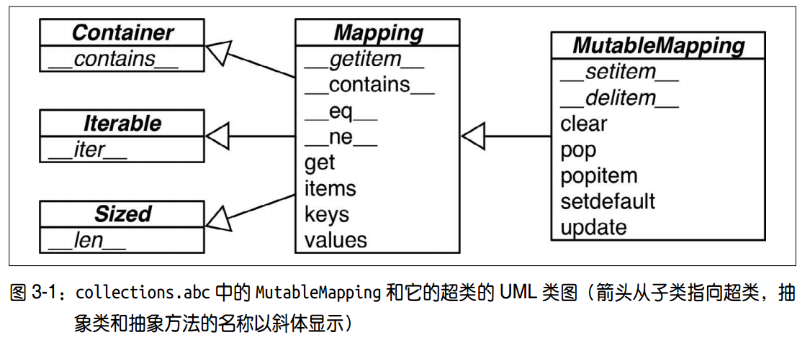
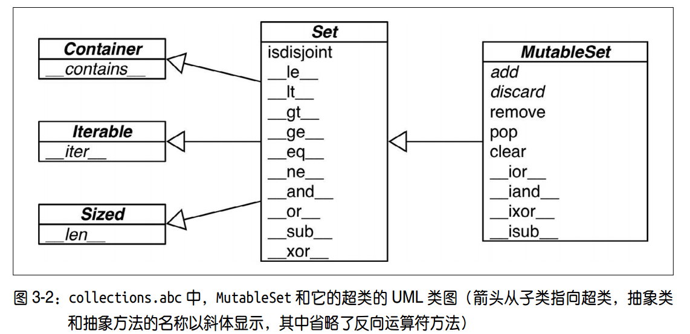
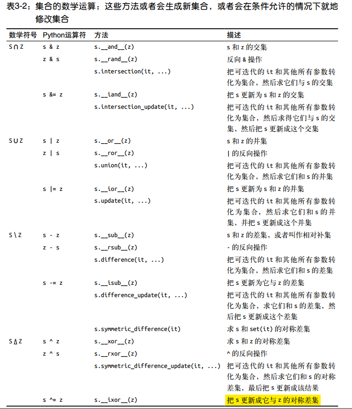
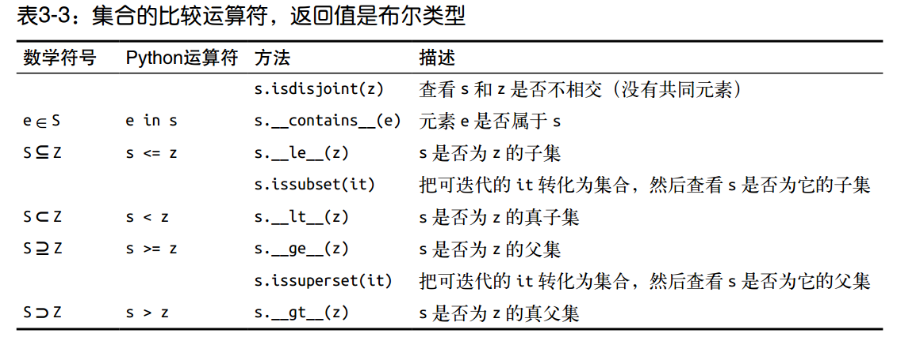
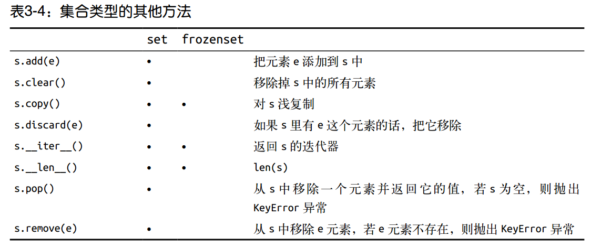
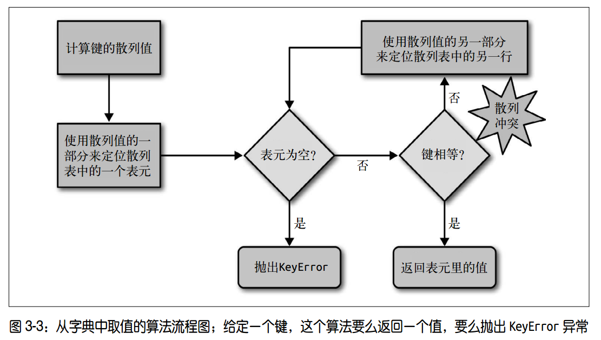

# 1.3 字典和集合
## 1. 内置散列类型概览


**抽象基类**:
  - 作用:
    - 作为形式化的文档，定义了构建一个映射类型所需要的最基本的接口
    - 跟 isinstance 一起被用来判定某个数据是不是广义上的映射类型

```python
>>> my_dict = {}
>>> isinstance(my_dict, abc.Mapping)
True
```

**非抽象映射类型**:
  - 一般不会直接继承抽象基类，而是直接对 dict 或是 collections.User.Dict 进行扩展
  - 标准库里的所有映射类型都是利用 dict 来实现的，因此它们有个共同的限制，
  只有 **可散列的数据类型** 才能用作这些映射里的键

**可散列的数据类型**:
  - 定义:
    - 在这个对象的生命周期中，散列值不可变
    - 支持 hash() 函数，并且通过 \_\_hash\_\_() 方法所得到的散列值是不变的
    - 支持通过 \_\_eq\_\_() 方法来检测相等性
    - 若 a == b 为真，则 hash(a) == hash(b) 也为真
  - 分类:
    - 原子不可变数据类型（ str、 bytes 和数值类型）都是可散列类型
    - frozenset 也是可散列的，只能容纳可散列类型
    - 元组只有当所包含的所有元素都是可散列类型的情况下，才是可散列的
  - 自定义类:
    - 用户自定义的类型的对象默认都是可散列的，散列值是它们的 id() 函数返回值，
    所以所有对象在比较的时候都是不相等的
    - 如果一个对象实现了 \_\_eq\_\_ 方法，并且在方法中用到了这个对象的内部状态的话，
    那么只有当所有这些内部状态都是不可变的情况下，这个对象才是可散列的

## 2. 字典用法
### 2.1 常见的映射方法
表3-1:  dict、 **collections.defaultdict** 和 **collections.OrderedDict**

|方法|dict|default|Ordered|作用|
|:---|:---|:---|:---|:---|:---|
|d.clear() |• |• |• |移除所有元素|
|d.\_\_contains\_\_(k) |• |• |• |检查 k 是否在 d 中|
|d.copy() |• |• |• |浅复制|
|d.\_\_copy\_\_() |• |||用于支持 copy.copy|
|d.default_factory ||• ||在 \_\_missing\_\_ 函数中被调用的函数，用以给未找到的元素设置值 *|
|d.\_\_delitem\_\_(k) |• |• |• |del d[k]，移除键为 k 的元素|
|d.fromkeys(it, [initial]) |• |• |• |将迭代器 it 里的元素设置为映射里的键，如果有 initial 参数，就把它作为这些键对应的值（默认是 None）|
|d.get(k, [default]) |• |• |• |返回键 k 对应的值，如果字典里没有键k，则返回 None 或者 default|
|d.\_\_getitem\_\_(k) |• |• |• |让字典 d 能用 d[k] 的形式返回键 k 对应的值|
|d.items() |• |• |• |返回 d 里所有的键值对|
|d.\_\_iter\_\_() |• |• |• |获取键的迭代器|
|d.keys() |• |• |• |获取所有的键|
|d.\_\_len\_\_() |• |• |• |可以用 len(d) 的形式得到字典里键值对的数量|
|**d.\_\_missing\_\_(k)**| |•| |当 \_\_getitem\_\_ 找不到对应键的时候，这个方法会被调用|
|d.move_to_end(k, [last])|| |•| 把键为 k 的元素移动到最靠前或者最靠后的位置（ last 的默认值是 True）|
|d.pop(k, [defaul] |• |• |• |返回键 k 所对应的值，然后移除这个键值对。如果没有这个键，返回 None 或者default|
|d.popitem() |• |• |• |随机返回一个键值对并从字典里移除它 #|
|d.\_\_reversed\_\_() |||• |返回倒序的键的迭代器|
|d.setdefault(k, [default]) |• |• |• |若字典里有键 k，则把它对应的值设置为default，然后返回这个值; 若无，则让d[k] = default，然后返回 default|
|d.\_\_setitem\_\_(k, v) |• |• |•| 实现 d[k] = v 操作，把 k 对应的值设为 v|
|d.update(m, [**kargs]) |• |• |•| m 可以是映射或者键值对迭代器，用来更新 d 里对应的条目|
|d.values() |•| •| •| 返回字典里的所有值|


### 2.2 映射的弹性键查询
#### collections.defaultdict
  - 实例化 defaultdict 时，需要提供一个可调用对象,这个可调用对象会在
  \_\_getitem\_\_ 碰到找不到的键的时候被调用，让 \_\_getitem\_\_ 返回某种默认值
  - 可调用对象存放在名为 default_factory 的实例属性里
  - eg: dd = defaultdict(list); dd['new-key']:
    - 调用 list() 来建立一个新列表
    - 把这个新列表作为值， 'new-key' 作为它的键，放到 dd 中
    - 返回这个列表的引用
  - 附注:
    - 创建 defaultdict 的时候没有指定 default_factory，查询不存在的键会触发KeyError
    - default\_factory 只在 \_\_getitem\_\_ 里被调用;
    eg: dd['new-key'] 返回 [],  dd.get('new-key') 返回None

#### \_\_missing\_\_方法
  - 作用: 如果存在，在 \_\_getitem\_\_ 碰到不存在键时会自动调用，而不是抛出KeyError 异常
  - 特性:
    - \_\_missing\_\_ 方法只会被 \_\_getitem\_\_ 调用
    - 对 get 或者 \_\_contains\_\_的使用没有影响

```python
# BEGIN STRKEYDICT0
class StrKeyDict0(dict):  # <1>

    def __missing__(self, key):
        # 测试时必需的，防止递归调用
        if isinstance(key, str):  # <2>
            raise KeyError(key)
        return self[str(key)]  # <3>

    def get(self, key, default=None):
        try:
            return self[key]  # <4>
        except KeyError:
            return default  # <5>

    def __contains__(self, key):
        # 使用self.keys() 是必需的，防止递归调用
        return key in self.keys() or str(key) in self.keys()  # <6>

# END STRKEYDICT0
```

## 3. 字典的变种
**collections.OrderedDict**:
  - 作用: 在添加键的时候会保持顺序，因此键的迭代次序总是一致的
  - popitem 方法默认删除并返回的是字典里的最后一个元素
  - popitem(last=False) 删除并返回第一个被添加进去的元素

**collections.ChainMap**:
  - 作用: 可以容纳数个不同的映射对象，在进行键查找时，这些对象
  会被当作一个整体被逐个查找，直到键被找到为止
  - 应用: 给有嵌套作用域的语言做解释器的时候很有用，
  可以用一个映射对象来代表一个作用域的上下文
  - 文档: <https://docs.python.org/3/library/collections.html#collections.ChainMap>
```python
import builtins
pylookup = ChainMap(locals(), globals(), vars(builtins))
```

**collections.Counter**:
  - 作用: 给键准备一个整数计数器，每次更新一个键的时候都会增加这个计数器
  - 应用: 给可散列表对象计数，或者是当成多重集
  - 文档: <https://docs.python.org/3/library/collections.html#collections.Counter>
  - 方法:
    - 实现了 + 和 - 运算符用来合并记录
    - most_common(n): 按照次序返回映射里最常见的 n 个键和它们的计数
```python
>>> ct = collections.Counter('abracadabra')
>>> ct
Counter({'a': 5, 'b': 2, 'r': 2, 'c': 1, 'd': 1})
>>> ct.update('aaaaazzz')
>>> ct
Counter({'a': 10, 'z': 3, 'b': 2, 'r': 2, 'c': 1, 'd': 1})
>>> ct.most_common(2)  # 按照次序返回映射里最常见的 n 个键和它们的计数
[('a', 10), ('z', 3)]
```

**colllections.UserDict**:
  - 作用: 把标准 dict 用纯 Python 又实现了一遍，是让用户继承写子类的

collections.TransformDict:
  - 文档: <https://www.python.org/dev/peps/pep-0455/>

## 4. 子类化UserDict
UserDict:
  - 优势: 就创造自定义映射类型来说，以 UserDict 为基类，总比以普通的 dict 为基类更方便
  - 原因: dict 有时会在某些方法的实现上走一些捷径，导致不得不在它的子类中重写这些方法，
  但是 UserDict 就不会带来这些问题
  - 特性:
    - UserDict 继承的是 MutableMapping, 而不是 dict
    - UserDict 有一个叫作data 的属性，是 dict 的实例，
    这个属性实际上是 UserDict 存储数据的地方

```python
import collections


class StrKeyDict(collections.UserDict):  # <1>

    def __missing__(self, key):  # <2>
        if isinstance(key, str):
            raise KeyError(key)
        return self[str(key)]

    def __contains__(self, key):
        return str(key) in self.data  # <3>

    def __setitem__(self, key, item):
        self.data[str(key)] = item   # <4>
```

## 5. 不可变映射类型
type.MappingProxyType:
  - 版本: python >=3.3
  - 作用:
    - 给这个类一个映射，返回一个只读的映射视图
    - 如果对原映射做出了改动，可以通过这个视图观察到
    - 但是无法通过这个视图对原映射做出修改


## 6. 集合
### 6.1 集合概论
set:
  - 像 {1, 2, 3} 的字面量， Python 会利用一个专门的叫作 BUILD_SET 的字节码来创建集合
  因此 {1, 2, 3} 的字面量句法比构造方法(set([1, 2, 3])）更快且更易读
  - 集合内元素可修改，不可散列

frozenset
  - 没有特殊的字面量句法，只能采用构造方法
  - 集合内元素不可修改，可散列

```python
>>> frozenset(range(10))
frozenset({0, 1, 2, 3, 4, 5, 6, 7, 8, 9})
```

集合推导
```python
>>> from unicodedata import name ➊
>>> {chr(i) for i in range(32, 256) if 'SIGN' in name(chr(i),'')} ➋
{'§', '=', '¢', '#', '¤', '<', '¥', 'μ', '×', '$', '¶', '£', '©',
'°', '+', '÷', '±', '>', '¬', '®', '%'}
```

### 6.2 集合操作









## 7. dict和set的实现
### 7.1 散列表
散列表原理:
  - 散列表其实是一个稀疏数组，散列表里的单元通常叫作表元
  - 散列表用空间换时间，Python 会保证大概还有三分之一的表元是空的，快要达到这个阈值的时候，
  原有的散列表会被复制到一个更大的空间里面
  - dict, set 的实现都依赖于散列表
  - 字典的散列表当中，一个键值对占用一个表元，每个表元分为两个部分，
  一个是对键的引用，另一个是对值的引用
  - 集合的散列表里存放的只有元素的引用

### 7.2 散列表算法

<https://docs.python.org/3/reference/datamodel.html#object.__hash__>

插入:
  - 插入新值时， Python 可能会按照散列表的拥挤程度来决定是否要重新分配内存为它扩容
  - 如果散列表的大小增加，散列值所占的位数和用作索引的位数也会随之增加，以减少散列冲突

### 7.2 dict 特性
**依赖于散列表**：
  - 键查询很快
  - 键必须是可散列的
  - 键的次序取决于添加顺序
  - 字典在内存上的开销巨大
    - 如果需要存放数量巨大的记录，那么元组或是具名元组构成的列表中会是比较好的选择
    - 自定义的类型中， \_\_slots\_\_ 属性可以改变实例属性的存储方式，由 dict 变成tuple
  - 往字典里添加新键可能会改变已有键的顺序，如果在迭代一个字典的所有键的过程中
  同时对字典进行修改，那么这个循环很有可能会跳过一些键——甚至是跳过那些字典中已经有的键

**扫描并修改字典**:
  - 首先对字典迭代，以得出需要添加的内容，把这些内容放在一个新字典里
  - 迭代结束之后再对原有字典进行更新

**字典视图**:
  - Python 3 中， .keys()、 .items() 和 .values() 方法返回的都是字典视图
  - 视图还有动态的特性，它们可以实时反馈字典的变化

### 7.3 set的特性
**依赖于散列表**：
  - 集合里的元素必须是可散列的。
  - 集合很消耗内存
  - 可以很高效地判断元素是否存在于某个集合。
  - 元素的次序取决于被添加到集合里的次序。
  - 往集合里添加元素，可能会改变集合里已有元素的次序

## 附注
### Python 版本差异
1. dict.keys():
  - python3 中返回值是一个“视图”，视图就像一个集合，与字典类似在视图里查找一个元素的速度很快
  <https://docs.python.org/3/library/stdtypes.html#dictionaryview-objects>
  - Python2 中返回值时一个列表

## 常用模块
ChainMap:<https://docs.python.org/3/library/collections.html#collections.ChainMap>

## 延伸阅读
书籍:《代码之美》第 18 章

blog: <http://pyvideo.org/video/276/the-mightydictionary-55>

Dictionary view objects: <https://docs.python.org/3/library/stdtypes.html#dictionaryview-objects>

CPython dictobject.c <https://hg.python.org/cpython/file/tip/Objects/dictobject.c>

## 杂谈
