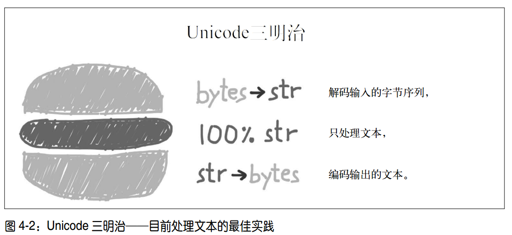

# 1.4 文本和字节序列
## 1. 字符与字节
### 1.1 字符的理解
**字符**:
  - "字符"的最佳定义是 Unicode 字符
  - Unicode 标准把 **字符的标识** 和 **具体的字节表述** 进行了如下的明确区分

**字符的标识**
  1. 字符的标识，即码位，是 0~1 114 111 的数字（十进制）
  2. Unicode 标准中以 4~6 个十六进制数字表示，而且加前缀"U+"
  3. 在 Unicode 6.3 中（这是 Python 3.4 使用的标准），约 10% 的有效码位有对应的字符

**字符的字节表述**
  1. 字符的具体表述取决于所用的编码
  2. 编码是在码位和字节序列之间转换时使用的算法

**编码**: 把码位转换成字节序列的过程  
**解码**: 把字节序列转换成码位的过程
```Python
>>> s = 'café'
>>> len(s)
4                        # café' 字符串有 4 个 Unicode 字符
>>> b = s.encode('utf8') # 使用 UTF-8 把 str 对象编码成 bytes 对象
>>> b
b'caf\xc3\xa9' # bytes 字面量以 b 开头
>>> len(b)
5             # 字节序列 b 有 5 个字节
>>> b.decode('utf8') # ➎
'café'
```

### 1.2 Python 中的字符对象
|类型|Python2.7|Python3.4|
|:---|:---|:---|
|unicdoe|字符的标识|无|
|str|字符的字节表示<br>各个元素是单个的字符<br>不可变类型|字符的标识<br>相当于Python2.7 中的unicode|
|bytes|str类型的别名|字符的字节表示<br>各个元素是介于 0~255（含）之间的整数<br>不可变类型|
|bytearray|字符的字节表示<br>各个元素是介于 0~255（含）之间的整数<br>可变类型|同Python2.7|

- 附注:
  - s[0] == s[:1] 只对 python3-str, python2-(str, unicode) 成立
  - 对其他各个序列类型来说， s[i]返回一个元素，而 s[i:i+1] 返回一个相同类型的序列

```python
# python2 str 与 python3 bytes 对比
# python27
>>> a="中国"
>>> a
'\xe4\xb8\xad\xe5\x9b\xbd'
>>> type(a[1])  # 各个元素是单个的字符
str
>>> a[1] == a[1:2] # 切片和对应位置的元素相同

# python34
>>> b=b"中国"
>>> b
b'\xe4\xb8\xad\xe5\x9b\xbd'
>>> b[1] # 各个元素是介于 0~255（含）之间的整数
184
>>> b[1] == b[1:2]
False
```

## 2. 二进制序列类型
二进制序列:
  - 包括: bytes 和 bytearray,  memoryview

```python
>>> cafe = bytes('café',  encoding='utf_8') ➊
>>> cafe
b'caf\xc3\xa9'
>>> cafe[0]     # 各个元素是 range(256) 内的整数
99
>>> cafe[:1]    # 切片还是 bytes 对象
b'c'
>>> cafe_arr = bytearray(cafe)
>>> cafe_arr        # bytearray 对象没有字面量句法
bytearray(b'caf\xc3\xa9')
>>> cafe_arr[-1:]   # bytearray 对象的切片还是 bytearray 对象
bytearray(b'\xa9')
```

### 2.1 bytes 和 bytearray
#### 字面量表示法
  - 可打印的 ASCII 范围内的字节（从空格到 ~），使用 ASCII 字符本身
  - 制表符、换行符、回车符和 \ 对应的字节，使用转义序列 \t、 \n、 \r 和 \\
  - 其他字节的值，使用十六进制转义序列（例如， \x00 是空字节）

#### 可用方法
**类 str 方法**
  - 除以下str类型方法外，都支持bytes和bytearray
    - 格式化方法 format和format_map
    - 处理Unicode数据的方法(包括casefold、isdecimal、isidentifier、isnumeric、
      isprintable和encode)
  - 如果正则表达式编译自二进制列而不是字符串， re 模块中的正则表达式函数也能处理二进制序列

**实例构建方法**
1. bytes.fromhex():解析十六进制数字对(数字对之间的空格是可选的)，构建二进制序列
```python
>>> bytes.fromhex('31 4B CE A9')
b'1K\xce\xa9'
```
2. 向构造函数传入以下参数:
  - 一个 str 对象和一个 encoding 关键字参数
  - 一个可迭代对象，提供 0~255 之间的数值
  - 一个整数，使用空字节创建对应长度的二进制序列 - python3.6将过时
  - 一个实现了缓冲协议的对象（如 bytes、 bytearray、 memoryview、 array.array）
  此时，把源对象中的字节序列 **复制** 到新建的二进制序列中

```python
>>> cafe = bytes('café',  encoding='utf_8')
>>> import array
>>> numbers = array.array('h',  [-2,  -1,  0,  1,  2])
>>> octets = bytes(numbers)  # 指定类型代码 h，创建一个短整数（ 16 位）数组
>>> octets
b'\xfe\xff\xff\xff\x00\x00\x01\x00\x02\x00' # 表示那 5 个短整数的 10 个字节
```

### 2.2 内存视图
#### memoryview
memoryview
  - 作用: 允许在二进制数据结构之间共享内存,
    - 通过其他二进制序列、打包的数组构建 memoryvideo对象时，不会复制字节序列
    - 对 memoryview 对象的切片，也不会复制字节序列
  - 介绍:
    - <http://stackoverflow.com/questions/4845418/when-should-a-memoryview-be-used/>
    - <https://docs.python.org/3/library/stdtypes.html#memory-views>

memoryview.cast
  - 类似于类型转换，能用不同的方式读写同一块内存数据

```python
# 通过改变数组中的一个字节来更新数组里某个元素的值 44 页
>>> numbers = array.array('h',  [-2,  -1,  0,  1,  2])
>>> memv = memoryview(numbers) ➊
>>> len(memv)
5
>>> memv[0] ➋
-2
>>> memv_oct = memv.cast('B') ➌
>>> memv_oct.tolist() ➍
[254,  255,  255,  255,  0,  0,  1,  0,  2,  0]
>>> memv_oct[5] = 4 ➎
>>> numbers
array('h',  [-2,  -1,  1024,  1,  2])
```

#### struct 模块
  - 作用: 从二进制序列中提取结构化信息
  - 介绍: <https://docs.python.org/3/library/struct.html>
  - 功能:
    - 一些函数，把打包的字节序列转换成不同类型字段组成的元组
    - 一些函数用于执行反向转换，把元组转换成打包的字节序列
    - 能处理 bytes、bytearray 和 memoryview 对象


```python
>>> import struct
# 结构体的格式:  < 是小字节序， 3s3s 是两个 3 字节序列， HH 是两个 16 位二进制整数
>>> fmt = '<3s3sHH'
>>> with open('filter.gif',  'rb') as fp:
... img = memoryview(fp.read()) # 创建一个 memoryview 对象
...
>>> header = img[:10] # 使用它的切片再创建一个 memoryview 对象; 这里不会复制字节序列
>>> bytes(header) # 转换成字节序列，这只是为了显示
b'GIF89a+\x02\xe6\x00'
>>> struct.unpack(fmt,  header)
(b'GIF',  b'89a',  555,  230) # 拆包 memoryview 对象，得到一个元组，包含类型、版本、宽度和高度
>>> del header # ➏
>>> del img
```

## 3. 编解码问题
### 3.1 编解码异常
异常类型:
  - UnicodeEncodeError: 编码错误
  - UnicodeDecodeError: 解码异常
  - SyntaxError: 源码的编码与预期不符，加载 Python 模块触发的异常

SyntaxError:
  - Python 3 默认使用 UTF-8 编码源码
  - Python 2（从 2.5 开始）则默认使用 ASCII
  - 如果加载的 .py 模块中包含默认编码之外的数据，而且没有声明编码，会触发SyntaxError: 异常
  ```python
  SyntaxError: Non-UTF-8 code starting with '\xe1' in file ola.py on line
  1,  but no encoding declared; see http://python.org/dev/peps/pep-0263/
  for details
  ```
  - 编码声明 - # coding: cp1252

errors参数:
  - 说明: 编码方法或函数中的参数，用于指明对错误进行处理的方式
  - error='struct': 默认值，出现错误则触发异常
  - error='ignore': 跳过无法编码的字符，通常很是不妥
  - error='replace'，把无法编码的字符替换成 '?'
  - error='xmlcharrefreplace': 把无法编码的字符替换成 XML 实体
  - 错误处理方式是可扩展的，为 errors 参数注册额外的字符串:
    - 方法是把一个名称和一个错误处理函数传给 codecs.register_error 函数
    - 参考 <https://docs.python.org/3/library/codecs.html#codecs.register_error>

### 3.2 编码识别
Chardet:
  - 作用: 编码侦测包,  能识别所支持的 30 种编码
  - 文档: <https://pypi.python.org/pypi/chardet>
  - 介绍: Chardet 是一个 Python 库,  也提供了命令行工具 chardetect

```bash
$ chardetect 04-text-byte.asciidoc
04-text-byte.asciidoc: utf-8 with confidence 0.99
```

### 3.3 BOM - 鬼符
```python
>>> u16 = 'El Niño'.encode('utf_16')
>>> u16
b'\xff\xfeE\x00l\x00 \x00N\x00i\x00\xf1\x00o\x00'
```

b'\xff\xfe':
- 这是 BOM，即字节序标记（ byte-order mark）
- 指明编码时使用Intel CPU 的小字节序
- 小字节序设备中，各个码位的最低有效字节在前面

UTF-16:
  - 为了避免混淆， UTF-16 编码在要编码的文本前面加上特殊的不可见字符
  ZERO WIDTH NOBREAK SPACE(U+FEFF)在小字节序系统中，这个字符编码为
  b'\xff\xfe'(十进制数255,  254)
  - UTF-16LE，显式指明使用小字节序
  - UTF-16BE，显式指明使用大字节序
  - 如果使用这两个变种，不会生成 BOM
  - 根据标准，如果文件使用 UTF-16 编码，而且没有 BOM，
  那么应该假定使用的是 UTF-16BE（大字节序）编码

附注:
  - 与字节序有关的问题只对一个字占多个字节的编码(如 UTF-16 和 UTF-32)有影响
  - UTF-8 的一大优势是，不管设备使用哪种字节序，生成的字节序列始终一致，因此不需要 BOM
  但是某些应用依旧会在 UTF-8 编码的文件中添加 BOM
  - Excel 会根据有没有 BOM 确定文件是不是 UTF-8 编码，否则，
  假设内容使用 Windows 代码页(codepage)编码

## 4. 文本处理

  - 要尽早把输入（例如读取文件时）的字节序列解码成字符串
  - 程序的业务逻辑，只处理字符串对象
  - 对输出来说，则要尽量晚地把字符串编码成字节序列
  - 打开文件时始终应该明确传入 encoding= 参数

## 5. 文本规范化和排序
### 5.1 文本规范化
内容太多，详见数 99-105

### 5.2 Unicode文本排序
PyUCA:
  - 作用: Unicode 排序算法(UCA)的纯 Python 实现
  - 文档: <https://pypi.python.org/pypi/pyuca/>
  - 附注:
    - PyUCA 没有考虑区域设置
    - 定制排序方式，可以把自定义的排序表路径传给Collator()构造方法
    - 默认使用项目自带的allkeys.txt 即Unicode 6.3.0 的副本
    - <http://www.unicode.org/Public/UCA/6.3.0/allkeys.txt>

```python
>>> import pyuca
>>> coll = pyuca.Collator()
>>> fruits = ['caju',  'atemoia',  'cajá',  'açaí',  'acerola']
>>> sorted_fruits = sorted(fruits,  key=coll.sort_key)
>>> sorted_fruits
['açaí',  'acerola',  'atemoia',  'cajá',  'caju']
```

### 5.3 Unicode数据库
数据库内容:
  - 码位与字符名称之间的映射
  - 各个字符的元数据
  - 字符之间的关系
  - eg: 字符是否可以打印、是不是字母、是不是数字，或者是不是其他数值符号
  - 字符串的 isidentifier、 isprintable、 isdecimal 等方法就是靠这些信息作判断

unicodedata
  - 作用: 获取字符的元数据
  - 文档: <https://docs.python.org/3/library/unicodedata.html>

```python
import unicodedata
import re

re_digit = re.compile(r'\d')
sample = '1\xbc\xb2\u0969\u136b\u216b\u2466\u2480\u3285'

for char in sample:
    print('U+%04x' % ord(char),
          char.center(6),
          're_dig' if re_digit.match(char) else '-',
          'isdig' if char.isdigit() else '-',
          'isnum' if char.isnumeric() else '-',
          format(unicodedata.numeric(char),  '5.2f'),
          unicodedata.name(char),
          sep='\t')
```

### 5.4 双模式 API
能接受字符串或字节序列为参数，然后根据类型进行特殊处理的函数

#### re
双模式:
  - 如果使用字节序列构建正则表达式， \d 和 \w 等模式只能匹配 ASCII 字符
  - 如果是字符串模式，就能匹配 ASCII 之外的 Unicode 数字或字母
  - 字节序列只能用字节序列正则表达式搜索
  - 字符串正则表达式有个 re.ASCII 标志，它让 \w、 \W、 \b、 \B、 \d、 \D、 \s 和 \S
  只匹配ASCII 字符

附注:
  - re 模块对 Unicode 的支持并不充分
  - PyPI 中新开发的regex 模块，用以取代 re 模块，以提供更好的 Unicode 支持

```python
import re

re_numbers_str = re.compile(r'\d+')  # 前两个正则表达式是字符串类型
re_words_str = re.compile(r'\w+')
re_numbers_bytes = re.compile(rb'\d+') # 后两个正则表达式是字节序列类型
re_words_bytes = re.compile(rb'\w+')

text_str = ("Ramanujan saw \u0be7\u0bed\u0be8\u0bef" ➌
" as 1729 = 1³ + 12³ = 9³ + 10³.") ➍
text_bytes = text_str.encode('utf_8') # 字节序列只能用字节序列正则表达式搜索。

print('Text',  repr(text_str),  sep='\n ')
print('Numbers')
print(' str :',  re_numbers_str.findall(text_str)) ➏
print(' bytes:',  re_numbers_bytes.findall(text_bytes)) ➐
print('Words')
print(' str :',  re_words_str.findall(text_str)) ➑
print(' bytes:',  re_words_bytes.findall(text_bytes))
```

### os函数中的字符串和字节序列？？
#### 背景:
  - GNU/Linux 内核不理解 Unicode，对任何合理的编码方案来说，在文
件名中使用字节序列都是无效的，无法解码成字符串
  - 为解决这个问题，os模块中的所有函数、文件名或路径名参数既能使用字符
串，也能使用字节序列
  - 如果函数使用字符串参数调用，该参数会使用 sys.getfilesystemencoding()
  得到的编解码器自动编码，然后操作系统会使用相同的编解码器解码
  - 如果必须处理（也可能是修正）那些无法使用上述方式自动处理的文件名，可以把
字节序列参数传给 os 模块中的函数，得到字节序列返回值

```python
>>> os.listdir('.') # ➊
['abc.txt',  'digits-of-π.txt']
>>> os.listdir(b'.') # 参数是字节序列， listdir 函数返回的文件名也是字节序列
[b'abc.txt',  b'digits-of-\xcf\x80.txt']
```
#### 可用函数
fsencode(filename):
  - 如果 filename 是 str 类型（此外还可能是 bytes 类型），使用
  sys.getfilesystemencoding()返回的编解码器把 filename 编码成字节序列;
  否则，返回未经修改的 filename 字节序列

fsdecode(filename):
  - 如果 filename 是 bytes 类型（此外还可能是 str 类型），使用
  sys.getfilesystemencoding() 返回的编解码器把 filename 解码成字符串;
  否则，返回未经修改的 filename字符串

在 Unix 衍生平台中，上述函数使用 surrogateescape 错误处理方式
  - 作用: 是处理意外字节序列或未知编码的一种方式, 可以避免遇到意外字节序列时卡住
  - 文档: <https://www.python.org/dev/peps/pep-0383/>
  - 实现:
    - 把每个无法解码的字节替换成 Unicode 中 U+DC00 到 U+DCFF 之间的码位
    - 这些码位是保留的，没有分配字符，供应用程序内部使用
    - 编码时，这些码位会还原成被替换的字节值

```python
>>> os.listdir('.')
['abc.txt',  'digits-of-π.txt']
>>> os.listdir(b'.')   # 假设我们不知道编码，获取文件名的字节序列形式。
[b'abc.txt',  b'digits-of-\xcf\x80.txt']
>>> pi_name_bytes = os.listdir(b'.')[1]
# 使用 'ascii' 编解码器和 'surrogateescape' 错误处理方式把它解码成字符串
>>> pi_name_str = pi_name_bytes.decode('ascii',  'surrogateescape')
>>> pi_name_str # 非 ASCII 字节替换成代替码位:  '\xcf\x80' 变成了 '\udccf\udc80'
'digits-of-\udccf\udc80.txt'
>>> pi_name_str.encode('ascii',  'surrogateescape') ➏
b'digits-of-\xcf\x80.txt' # 编码成 ASCII 字节序列: 各个代替码位还原成被替换的字节
```

## 延伸阅读
### Python:
标准库
  - mmap:
   - 作用: 将文件打开为内存映射文件
   - url: <https://docs.python.org/3/library/mmap.html>
  - unicode:
    - <https://docs.python.org/3/howto/unicode.html>
  - codecs:
    - <https://docs.python.org/3/library/codecs.html#standard-encodings>
    - <https://hg.python.org/cpython/file/6dcc96fa3970/Tools/unicode/listcodecs.py>

Python3.5新特性
  - 二进制序列引入新的构造方法和方法
    - <https://www.python.org/dev/peps/pep-0467/>
  - Adding % formatting to bytes
    - <https://www.python.org/dev/peps/pep-0461/>

### blog:
unicode 文本规范
  - <http://nedbatchelder.com/text/unipain.html>
  - <http://www.slideshare.net/fischertrav/character-encoding-unicode-how-towith-dignity-33352863>
  - <http://pyvideo.org/pycon-us-2014/character-encoding-and-unicodein-python.html>
  - <https://regebro.wordpress.com/2011/03/23/unconfusing-unicode-what-is-unicode/>

python 版本差异:
  - <https://docs.python.org/3.0/whatsnew/3.0.html#text-vs-data-instead-ofunicode-vs-8-bit>
  - <http://lucumr.pocoo.org/2013/7/2/theupdated-guide-to-unicode/>

文本与二进制序列
  - <http://python-notes.curiousefficiency.org/en/latest/python3/binary_protocols.html>
  - <http://python-notes.curiousefficiency.org/en/latest/python3/text_file_processing.html>

sys.getdefaultencoding()
  - <http://blog.startifact.com/posts/older/changing-the-python-default-encoding-considered-harmful.html>
  - <http://blog.ziade.org/2008/01/08/syssetdefaultencoding-isevil/>

### 实用工具  
AsciiDoc:
  - <http://www.methods.co.nz/asciidoc/>

### 书籍:
Dive into Python:
  - <http://www.diveintopython3.net>
  - <http://www.diveintopython3.net/strings.html>
  - <http://getpython3.com/diveintopython3/case-study-porting-chardet-to-python-3.html>

Programming with Unicode:
  - <http://unicodebook.readthedocs.org/index.html>

unicdoe规范化:
  - <https://www.w3.org/International/wiki/Case_folding>
  - <https://www.w3.org/TR/charmod-norm/>
  - <http://unicode.org/reports/tr15/>
  - <http://www.unicode.org/faq/normalization.htm>
  - <http://www.macchiato.com/unicode/nfc-faq>

## 杂谈
在RAM 中如何表示字符串
  - 详细介绍: <https://www.python.org/dev/peps/pep-0393/>
  - 在 Python 3.3 之前，编译 CPython 时可以配置在内存中使用 16 位或 32 位存储各个码位
  - 从 Python 3.3 起，创建 str 对象时，解释器会检查里面的字符，
  然后为该字符串选择最经济的内存布局
  - 灵活的字符串表述类似于 Python 3 对 int 类型的处理方式: 如果一个整数在一个机器
字中放得下，那就存储在一个机器字中; 否则解释器切换成变长表述，类似于 Python 2中的 long 类型
