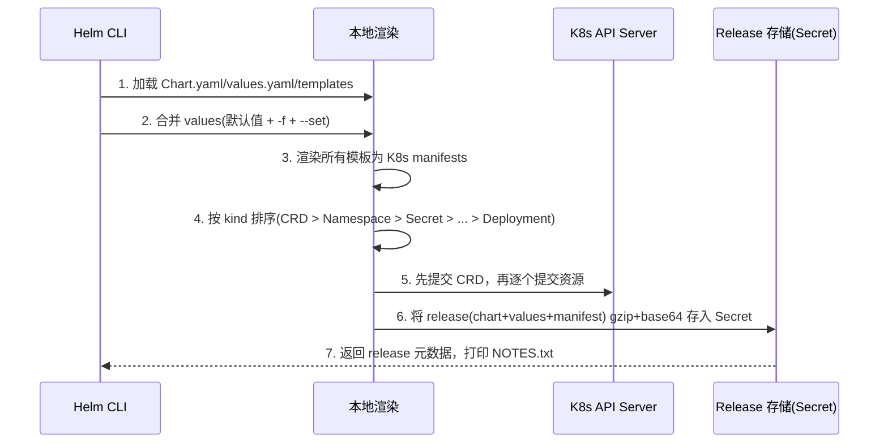

## 1. Helm 简介

Helm 是 Kubernetes 的包管理器，类似于 Linux 下的 apt/yum。K8s 本身只提供最小化的 API 对象，一个应用往往由 Deployment、Service、ConfigMap、Ingress 等十几个 YAML 组成，手工管理这些 YAML 存在两个问题:

1. 无法参数化: 同一套 YAML 想部署多套环境(dev/prod)，只能复制粘贴修改
2. 无法版本化: 应用升级回滚靠手工 `kubectl apply`，没有版本记录

Helm 通过 **Chart(打包) + Values(参数化) + Release(版本化实例)** 解决这两个问题。三个核心概念:

| 概念       | 说明                                                                                   | 类比               |
| :--------- | :------------------------------------------------------------------------------------- | :----------------- |
| Chart      | 一个应用的所有 K8s 资源模板的打包，包含 `Chart.yaml`、`values.yaml`、`templates/`      | deb 包 / rpm 包    |
| Repository | Chart 的远程仓库，存放和索引 chart 包                                                  | apt 源             |
| Release    | Chart 在 K8s 集群中的一次安装实例，同一个 chart 可以安装多次，每次是一个独立的 release | 安装的一个软件实例 |

一句话总结 helm install: **Chart 模板 + values 配置 → 渲染成 K8s manifests → 提交给集群 → 记录为一个带版本号的 release**。

本文以 [ory/k8s](https://github.com/ory/k8s) 仓库中的 kratos chart(`helm/charts/kratos`)为例，介绍 helm 的核心用法。

## 2. Chart 包的结构

### 2.1 目录结构

以 kratos chart 为例:

```text
kratos/
├── Chart.yaml              # chart 元信息: 名称、版本、依赖
├── Chart.lock              # 依赖锁定文件(类似 package-lock.json)
├── values.yaml             # 模板的默认配置值
├── .helmignore             # 打包时忽略的文件(类似 .gitignore)
├── README.md               # chart 使用说明(渲染到 ArtifactHub 页面)
├── charts/                 # 依赖的子 chart
│   └── ory-commons-0.1.0.tgz
├── files/                  # 普通文件(chart 作者自定义约定，通过 .Files 访问)
│   └── watch.sh
└── templates/              # K8s 资源模板
    ├── _helpers.tpl        # 模板辅助函数定义
    ├── deployment-kratos.yaml
    ├── service-public.yaml
    ├── service-admin.yaml
    ├── ingress-public.yaml
    ├── configmap-config.yaml
    ├── secrets.yaml
    ├── job-migration.yaml
    ├── NOTES.txt           # install 成功后输出的使用说明
    └── tests/
        └── test-connection.yaml   # helm test 要运行的测试 Pod
```

只有 `Chart.yaml` 是强制的，其他都是约定俗成。文件名的前缀只是作者用来归类(如 `deployment-`、`configmap-`、`rbac-`)，helm 渲染时会按文件名排序遍历 `templates/` 下所有文件，与文件名无关。

### 2.2 Chart.yaml

```yaml
apiVersion: v2 # apiVersion v2 对应 Helm 3
appVersion: "v26.2.0" # chart 所封装应用的版本(与 chart 自身版本无关)
description: A ORY Kratos Helm chart for Kubernetes
name: kratos
icon: https://raw.githubusercontent.com/ory/docs/master/docs/static/img/logo-kratos.svg
version: 0.63.0 # chart 自身的版本，遵循语义化版本
type: application # application=可安装应用, library=被依赖的模板库
dependencies:
  - name: ory-commons # 依赖的子 chart
    version: 0.1.0
    repository: file://../ory-commons # 本地路径依赖
    alias: ory # 别名，模板中通过 .Values.ory.xxx 引用
```

注意 `version` 是 chart 的版本，`appVersion` 是所部署应用的版本，两者独立演进。

### 2.3 values.yaml 与模板

`values.yaml` 提供模板的默认值，模板中通过 `.Values.xxx` 引用:

```yaml
# values.yaml
replicaCount: 1

image:
  registry: "docker.io"
  repository: oryd/kratos
  tag: v26.2.0
  pullPolicy: IfNotPresent

service:
  admin:
    enabled: true
    type: ClusterIP
    port: 80
```

模板是标准的 K8s YAML + Go template 指令，例如 `templates/deployment-kratos.yaml`:

```yaml
apiVersion: apps/v1
kind: Deployment
metadata:
  name: {{ include "kratos.fullname" . }}
  labels:
    {{- include "kratos.labels" . | nindent 4 }}
spec:
  {{- if not .Values.autoscaling.enabled }}
  replicas: {{ .Values.replicaCount }}
  {{- end }}
  template:
    spec:
      containers:
        - name: {{ include "kratos.name" . }}
          image: {{ include "kratos.image" . }}
          imagePullPolicy: {{ include "kratos.imagePullPolicy" . }}
```

`_helpers.tpl` 中定义可复用的模板片段，用 `define` 声明、`include` 调用:

```yaml
{{- define "kratos.fullname" -}}
{{- if .Values.fullnameOverride -}}
{{- .Values.fullnameOverride | trunc 63 | trimSuffix "-" -}}
{{- else -}}
{{- printf "%s-%s" .Release.Name $name | trunc 63 | trimSuffix "-" -}}
{{- end -}}
{{- end -}}
```

这是官方 chart 的标准模式: 复杂逻辑全部收敛到 `_helpers.tpl`，业务模板保持简洁。

## 3. 核心命令

### 3.1 下载 chart 包到指定目录

方式一: 从仓库下载 `helm pull`。以 ory 官方仓库为例，将 kratos chart 下载到 `D:\Blog\backup\ddd-learn\deployments\gateway\helm`:

```bash
# 1. 添加仓库
$ helm repo add ory https://k8s.ory.com/helm/charts
$ helm repo update

# 2. 查看仓库中可用的版本
$ helm search repo ory/kratos --versions

# 3. 下载 chart 包(tgz 压缩包)
$ helm pull ory/kratos --version 0.63.0 --destination D:\Blog\backup\ddd-learn\deployments\gateway\helm

# 4. 下载并解压成目录
$ helm pull ory/kratos --untar --untardir D:\Blog\backup\ddd-learn\deployments\gateway\helm
```

**`--version` 指定的是 chart 版本还是应用版本？** 是 **chart 版本**，即 Chart.yaml 中的 `version` 字段(chart 包自身的迭代版本)，不是 `appVersion`(chart 所封装的 Kratos 应用版本 `v26.2.0`)。两者独立演进，安装时通过 `--version` 精确锁定 chart 包。

**如何查看所有可用版本？** `helm search repo` 默认每个 chart 只显示最新一条，加 `--versions` 参数列出全部历史版本:

```bash
$ helm search repo ory/kratos --versions
NAME        CHART VERSION   APP VERSION  DESCRIPTION
ory/kratos  0.63.0          26.2.0       A ORY Kratos Helm chart for Kubernetes
ory/kratos  0.62.1          26.2.0       A ORY Kratos Helm chart for Kubernetes
ory/kratos  0.62.0          26.2.0       A ORY Kratos Helm chart for Kubernetes
...

$ helm search repo ory/kratos            # 不加 --versions，只显示最新版
```

下载完成后目录结构:

```text
gateway/helm/
└── kratos/
    ├── Chart.yaml
    ├── values.yaml
    ├── charts/
    └── templates/
```

方式二: 直接 clone 源码仓库(想改 chart 源码时用这种):

```bash
$ git clone https://github.com/ory/k8s.git
# chart 位于 k8s/helm/charts/kratos
```

下载前也可以先查看 chart 信息而不下载:

```bash
$ helm show chart ory/kratos    # 查看 Chart.yaml
$ helm show values ory/kratos   # 查看 values.yaml，写自定义配置前先看这个
$ helm show readme ory/kratos   # 查看 README
```

### 3.2 安装本地 chart 包

`helm install [RELEASE_NAME] [CHART]`，CHART 可以是本地目录、tgz 包或仓库引用:

```bash
# 安装本地目录，-n 指定 namespace，--create-namespace 不存在时自动创建
$ helm install my-kratos D:\Blog\backup\ddd-learn\deployments\gateway\helm\kratos -n kratos --create-namespace

# 使用自定义 values 文件覆盖默认值(-f 可指定多次，后面的优先)
$ helm install my-kratos ./kratos -f my-values.yaml -n kratos

# 用 --set 快速覆盖单个值(适合 CI 中传参，多级用 . 分隔)
$ helm install my-kratos ./kratos --set replicaCount=2 --set service.admin.port=8080

# 数组元素用 key[index] 语法
$ helm install my-kratos ./kratos --set 'args[0]=--verbose'
```

安装前先本地渲染校验，是排查模板问题的最重要手段:

```bash
$ helm lint ./kratos              # 语法与规范检查
$ helm template my-kratos ./kratos -f my-values.yaml   # 只渲染不提交集群，查看最终 YAML
$ helm install my-kratos ./kratos --dry-run --debug    # 走一遍 install 流程但不真正提交
```

### 3.3 其它重要命令

```bash
# ---- 查看 release ----
$ helm list -n kratos                 # 列出 namespace 下所有 release(-A 全部)
$ helm status my-kratos -n kratos     # release 状态
$ helm history my-kratos -n kratos    # 升级历史(revision 列表)
$ helm get manifest my-kratos         # 查看该 release 实际提交给集群的完整 YAML
$ helm get values my-kratos           # 查看用户提交的 values(-a 连默认值一起看)
$ helm get notes my-kratos            # 查看 NOTES.txt
$ helm get all my-kratos              # 以上全部

# ---- 升级与回滚 ----
$ helm upgrade my-kratos ./kratos -f my-values.yaml   # 原地升级，revision +1
$ helm upgrade --install my-kratos ./kratos           # 不存在则 install，存在则 upgrade，CI 部署标配
$ helm rollback my-kratos 3 -n kratos                 # 回滚到 revision 3

# ---- 卸载 ----
$ helm uninstall my-kratos -n kratos

# ---- 打包与测试 ----
$ helm package ./kratos               # 打成 kratos-0.63.0.tgz
$ helm test my-kratos                 # 运行 templates/tests/ 下的测试 Pod

# ---- 仓库管理 ----
$ helm repo add ory https://k8s.ory.com/helm/charts
$ helm repo update                    # 更新本地索引(apt update)
$ helm search repo kratos             # 搜索仓库
$ helm search hub kratos              # 搜索 ArtifactHub
```

## 4. helm install 的执行过程

### 4.1 流程

`helm install` 的完整过程:



几个关键点:

1. **values 合并顺序**: chart 内置 `values.yaml`(最低优先级) → `-f` 指定的文件 → `--set` 参数(最高优先级)，多层 map 是深度合并
2. **渲染顺序**: helm 不是按文件名渲染，而是按 kind 的固定优先级排序提交，保证 Namespace 在前、Deployment 在后
3. **release 记录**: 每次 install/upgrade/rollback 都会生成一个新 revision，完整记录到 release 存储

### 4.2 Release 的产生与查看

Helm 3 将 release 存为 K8s Secret(默认)，命名规则为 `sh.helm.release.v1.<release-name>.v<revision>`:

```bash
# 查看某个 namespace 下的 release 存储
$ kubectl get secrets -n kratos -l owner=helm,name=my-kratos
NAME                            TYPE                 DATA   AGE
sh.helm.release.v1.my-kratos.v1   helm.sh/release.v1   1      5m
sh.helm.release.v1.my-kratos.v2   helm.sh/release.v1   1      3m
```

Secret 的内容就是该次部署的完整快照(chart、values、渲染后的 manifest 被 gzip + base64 后存入 `data.release` 字段)。helm upgrade/rollback 就是往这个列表里追加新 revision、或把旧 revision 的 manifest 重新 apply。

日常查看不直接解析 Secret，用 helm 命令:

```bash
$ helm list -n kratos
NAME       NAMESPACE  REVISION  STATUS    CHART          APP VERSION
my-kratos  kratos     2         deployed  kratos-0.63.0  v26.2.0

$ helm history my-kratos -n kratos
REVISION  STATUS      CHART          DESCRIPTION
1         superseded  kratos-0.63.0  Install complete
2         deployed    kratos-0.63.0  Upgrade complete

$ helm get manifest my-kratos -n kratos   # 该 release 提交过的全部 YAML(排查资源归属)
```

> release 与 namespace 绑定，`helm list` 不加 `-A` 时只查当前 namespace，找不到 release 时先确认 namespace。

## 5. 自定义一个 helm chart

### 5.1 创建 chart

```bash
$ helm create myapp
Creating myapp

$ tree myapp
myapp/
├── Chart.yaml
├── values.yaml
├── .helmignore
└── templates/
    ├── _helpers.tpl
    ├── deployment.yaml
    ├── service.yaml
    ├── ingress.yaml
    ├── serviceaccount.yaml
    ├── hpa.yaml
    ├── NOTES.txt
    └── tests/
        └── test-connection.yaml
```

`helm create` 生成的就是一个可安装的最小 chart，自带一套最佳实践模板。

### 5.2 修改 values 与模板

改 `values.yaml`，把自己的镜像和配置作为默认值:

```yaml
replicaCount: 1

image:
  repository: myrepo/myapp
  tag: "1.0.0"
  pullPolicy: IfNotPresent

service:
  type: ClusterIP
  port: 80

resources:
  requests:
    cpu: 100m
    memory: 128Mi
  limits:
    cpu: 500m
    memory: 512Mi
```

典型改造点:

1. 把写死的值(镜像、端口、副本数、资源配额)全部提为 values
2. 不需要的资源(如 ingress、hpa)在模板最外层用 `{{- if }}` 包起来，通过 values 开关:

```yaml
{{- if .Values.ingress.enabled }}
apiVersion: networking.k8s.io/v1
kind: Ingress
metadata:
  name: {{ include "myapp.fullname" . }}
  ...
{{- end }}
```

3. 配置文件等复杂内容挂 ConfigMap，值来自 values:

```yaml
apiVersion: v1
kind: ConfigMap
metadata:
  name: {{ include "myapp.fullname" . }}-config
data:
  app.yaml: |
{{ toYaml .Values.config | indent 4 }}
```

### 5.3 验证与部署

```bash
$ helm lint ./myapp                      # 静态检查
$ helm template myapp ./myapp --set image.tag=dev   # 本地渲染，人工核对 YAML
$ helm install myapp ./myapp --dry-run --debug      # 完整走一遍流程
$ helm upgrade --install myapp ./myapp   # 真正部署
$ helm test myapp                        # 运行 tests/ 下的连通性测试
```

### 5.4 打包分发

```bash
$ helm package ./myapp            # 生成 myapp-0.1.0.tgz
```

发布有两种途径:

- 简单场景: 把 tgz 上传到对象存储/HTTP 目录，用 `helm repo add myrepo https://xxx --username xx --password xx` 引用
- 团队/公开场景: 推到 git 仓库，用 [ChartMuseum](https://github.com/helm/chartmuseum) 或 GitHub Pages + `helm repo index` 生成索引，再推到 [ArtifactHub](https://artifacthub.io/)

### 5.5 拆分依赖(subchart)

当一个 chart 依赖另一个 chart(如 kratos 依赖 `ory-commons`)时，在 `Chart.yaml` 中声明:

```yaml
dependencies:
  - name: ory-commons
    version: 0.1.0
    repository: file://../ory-commons # 本地路径依赖
    alias: ory # 引用别名
```

然后执行 `helm dependency build`，helm 会把依赖下载/打包进 `charts/` 目录。

子 chart 的 values 隔离在不同命名空间下:

```yaml
# 父 chart 的 values.yaml 中给子 chart 传参
ory: # alias 或 name
  key: value # 会透传给子 chart

global: # global 会透传给所有子 chart
  imageRegistry: myregistry.com
```

## 6. 模板语法要点

### 6.1 内置对象

| 对象            | 说明                             | 常用字段                                                     |
| :-------------- | :------------------------------- | :----------------------------------------------------------- |
| `.Values`       | values.yaml + 用户覆盖合并后的值 | `.Values.image.tag`                                          |
| `.Release`      | 本次安装的 release 信息          | `.Release.Name` / `.Release.Namespace` / `.Release.Revision` |
| `.Chart`        | Chart.yaml 的内容                | `.Chart.Name` / `.Chart.Version` / `.Chart.AppVersion`       |
| `.Files`        | chart 内的非模板文件             | `.Files.Get "files/watch.sh"` / `.Files.Glob`                |
| `.Capabilities` | 集群能力                         | `.Capabilities.KubeVersion`                                  |
| `.Template`     | 当前模板信息                     | `.Template.BasePath`(templates 目录路径)                     |

### 6.2 常用函数

```yaml
{{ default "80" .Values.port }}          # 默认值
{{ quote .Values.name }}                 # 加引号
{{ toYaml .Values.strategy }}            # map 转成 YAML(多行)
{{ .Values.labels | toYaml | nindent 4 }}# 先转 YAML 再换行+缩进 4 格(最常用组合)
{{ include "myapp.labels" . }}           # 调用 define 定义的模板片段
{{ tpl .Values.extraConfig . }}          # 先渲染字符串中的模板语法，再输出
{{ upper .Values.env }} {{ trunc 63 . }} # 字符串处理
{{ printf "%s-%s" .Release.Name .Chart.Name }}
{{ sha256sum (include "myapp.config" .) }}   # 生成 checksum
{{ omit .Values.config "secret" }}       # 删除指定 key 后输出
{{ ternary "a" "b" .Values.enabled }}    # 三元表达式: true→a, false→b
{{ fail "config must be set" }}          # 渲染期直接报错
```

### 6.3 控制结构与常见坑

```yaml
# if / else
{{- if eq .Values.service.type "NodePort" }}
nodePort: {{ .Values.service.nodePort }}
{{- else }}
port: {{ .Values.service.port }}
{{- end }}

# range 遍历
{{- range $key, $value := .Values.extraEnv }}
- name: {{ $key }}
  value: {{ $value | quote }}
{{- end }}

# with: 限定作用域，块内直接访问 .Values 下的字段
{{- with .Values.resources }}
resources:
  {{- toYaml . | nindent 8 }}
{{- end }}
```

三个高频坑:

1. **空白符**: `{{-` 会吃掉前方的空白和换行，多行 YAML 常因此错位，换行缩进一律用 `nindent` 而不是 `indent`
2. **作用域丢失**: `with`/`range` 内 `.` 被替换，拿不到 `.Release` 等顶层对象。进入作用域前用 `$` 保存根对象(如 `{{ $.Release.Name }}`)，或 `include "tpl" (dict "ctx" $ "v" .Values.xxx)` 传参
3. **引号**: 数字和布尔值加引号会变成字符串导致类型不匹配(如 K8s 数值字段)，用 `| quote` 前先确认目标字段类型；`--set key=value` 传的都是字符串，数值类型建议走 `-f` 文件

## 7. 最佳实践与常见问题

**1. values 优先级(高 → 低)**

```text
--set > -f 多次指定时后面的文件 > chart 自带 values.yaml
```

项目上推荐: chart 自带 `values.yaml` 保持官方默认，环境差异用独立文件 `values-prod.yaml` / `values-staging.yaml` 管理，`--set` 只留给 CI 变量注入。

**2. ConfigMap 变更后 Pod 不重启**

ConfigMap 已挂载时 K8s 不会重启使用它的 Pod。标准解法是在 Pod 上加 checksum 注解，config 一变注解值就变，触发 Deployment 滚动更新(kratos 中就是这么做的):

```yaml
template:
  metadata:
    annotations:
      checksum/config:
        {
          {
            include (print $.Template.BasePath "/configmap-config.yaml") . | sha256sum,
          },
        }
```

**3. 幂等部署**

CI/CD 中统一使用 `helm upgrade --install`，chart 未变时 upgrade 是 no-op，不会引起滚动重启。

**4. 排查三板斧**

```bash
$ helm lint ./kratos                          # 渲染前: 语法问题
$ helm template my-kratos ./kratos -f my.yaml # 渲染中: 查看最终 YAML
$ helm get manifest my-kratos                 # 渲染后: 集群里实际是什么
```

`--dry-run` 默认只做客户端渲染，加 `--dry-run=server` 会调用 API Server 校验资源(如配额、admission webhook)，更接近真实结果。

**5. 卸载不干净**

`helm uninstall` 会删除 release 创建的所有资源，但 PVC 默认不删(需要 chart 模板显式声明 `helm.sh/resource-policy: keep` 才保留)，卸载后如果重新 install 数据还在/报资源冲突，用 `kubectl get all,pvc,secret -n <ns> -l app.kubernetes.io/instance=<release>` 检查残留。
